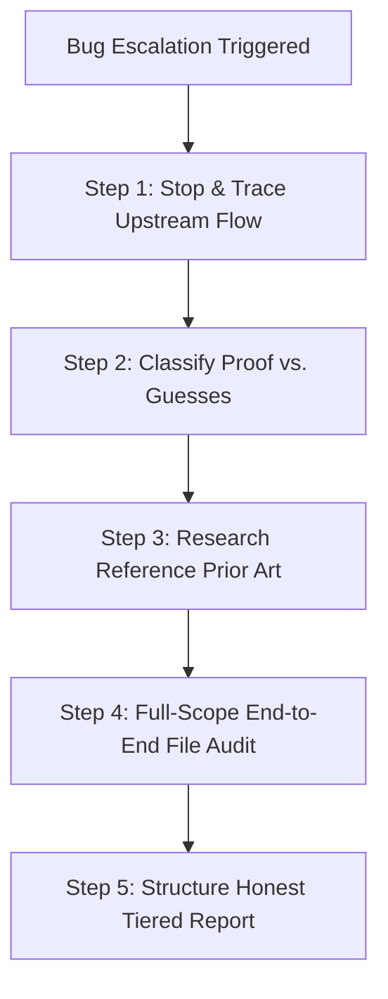

# Deep Debug Audit

> **Core Philosophy:** If you've patched the same symptom more than once, the next patch should not be another patch — it should be an investigation.

`deep-debug-audit` is an escalation protocol for when repeated local parameter tweaks or symptom-level patches fail to resolve a root cause. It halts patch cycles and enforces systematic upstream tracing, factual classification, prior-art research, end-to-end system auditing, and honest confidence-tiered reporting.

---

## 🎯 Activation Criteria

### Trigger When Any of the Following Are True:
- 🔁 **Repeated Fixes (2+ Rule):** The same category of bug (visual artifact, incorrect output, crash, layout corruption) has been "fixed" 2 or more times, yet persists or manifests in adjacent scenarios.
- 🤏 **Local Patching Traps:** Previous attempts were narrow, localized parameter tweaks (e.g., altering a threshold, filter condition, boundary check, or hardcoded magic number) rather than architectural fixes.
- 📐 **Architecture Uncertainty:** The user requests a comprehensive code review, expresses doubt about system soundness, or asks to evaluate alternative tools/models/libraries.
- 🛑 **Self-Correction Alert:** You catch yourself proposing another small tweak for a problem you've already tweaked parameters for.

### 🚫 Do NOT Trigger When:
- First-time bug reports.
- Isolated, single-cause syntax or logic errors with clear, deterministic failure paths.

---

## 🗺️ Protocol Workflow



---

## 📋 The 5-Step Audit Protocol

### Step 1: Stop Patching, Start Upstream Tracing

> [!IMPORTANT]
> Do not write or touch code yet. Trace data and control flow from source origin to final symptom output.

- **Trace Every Pipeline Stage:** Trace affected data from its ingress point through every transformation, buffer, or handler—not just the final display/execution function.
- **Uncover Shared Upstream Root Causes:** Multiple downstream symptom patches are a primary indicator of a single upstream decision error.
- **Concrete Scenario:**
  - *Symptom:* Text bounding box overlap and visual corruption in an image processing pipeline. Downstream fixes (confidence cutoffs, aspect-ratio filters, non-max suppression tweaks) continuously fail.
  - *Upstream Cause:* Step 1 in the pipeline squashes high-aspect-ratio inputs into a fixed square before inference runs. Downstream code was receiving already-destroyed data.
  - *Fix:* Correcting the scaling at Step 1 resolves all downstream symptoms without requiring downstream filtering hacks.

---

### Step 2: Separate Proven Facts from Unverified Guesses

Before formulating a solution, classify every hypothesis and proposed change into one of two confidence tiers:

| Tier | Definition | Standard |
| :--- | :--- | :--- |
| 🟢 **High Confidence** | Deterministic logic errors verifiable by inspection/reasoning alone (e.g., an unhandled `null`, off-by-one index, incorrect variable binding). | Propose and fix directly with technical explanation. |
| 🟡 **Medium / Low Confidence** | Assumptions depending on unverified third-party library behavior, external schemas, model preprocessing specs, or OS edge cases. | State the assumption explicitly to the user before writing code. **Never mask guesses as facts.** |

> [!WARNING]
> Presenting an unverified guess as a confident fix causes the **"fixed it, still broken"** loop. If an exact payload shape or config property is unconfirmed, declare it explicitly.

---

### Step 3: Research Reference Implementations

When handling medium/low confidence technical areas or complex integrations, inspect how established prior art solves the problem before inventing custom logic.

#### Source Hierarchy (In Order of Preference):
1. 🥇 **Working Reference Code / Official Repositories:** Code from canonical or widely respected open-source projects handling the same domain.
2. 🥈 **Official Documentation & Technical Specifications:** Published standards, API specifications, and vendor documentation.
3. 🥉 **Second-Hand Summaries / Blog Posts:** Articles or discussion forum posts (treat details from these as *unverified hypothesis* until tested).

---

### Step 4: Audit Every File in the Affected System

> [!NOTE]
> Bugs cluster in codebases. Read every file within the subsystem end-to-end, including files previously assumed to be working.

#### Audit Checklist:

- [ ] **Dead Code & Unreachable Branches:** Fallbacks or conditional logic structurally blocked by earlier assertions or return statements.
- [ ] **Interface Drift:** Signatures, parameter names, or return schemas altered in one module but lingering out-of-date in caller sites or sibling modules.
- [ ] **Platform & Locale Issues:** Path delimiters, character encodings, timezones, or file line-endings fixed in one file but repeated across sibling endpoints.
- [ ] **Silent UX & State Gaps:** Server-side actions completing successfully without returning output, updating UI state, or notifying the user.
- [ ] **Stale Imports & Residual Parameters:** Leftover variables, unused imports, or unused arguments from abandoned prior patches.

> [!TIP]
> Report what was inspected and found clean, not just what was broken. This gives the user full visibility into the audit scope.

---

### Step 5: Report with Honest, Separated Confidence Levels

Present your audit conclusions to the user in a structured format separated by verification state:

---

## 📄 Audit Report Template

```markdown
# 🔍 Deep Debug Audit Report

## 📍 Upstream Root Cause Analysis
- **Observed Symptoms:** [List symptoms]
- **Pipeline Data Path:** [Source] -> [Stage 1] -> [Stage 2] -> [Symptom Location]
- **Root Cause Identified:** [Detailed explanation of the single upstream decision causing downstream issues]

---

## 🟢 Confirmed & Resolved (High Confidence)
- **[File / Module]:** [Description of deterministic bug and exact resolution]

---

## 🟡 Evidence-Based Improvements (Pending Verification)
- **[File / Module]:** [Description of change based on reference patterns or documentation]
- **Verification Required:** [What test, log, or input condition is needed to confirm this fix]

---

## 🔴 Unresolved Items & Next Steps
- **Open Questions:** [List remaining uncertainties or unverified third-party behaviors]
- **Action Needed from User:** [Any manual testing, environment setup, or log output required]

---

## 🛡️ Clean Files Audited
- `path/to/file1.py` - Verified data flow and interface consistency.
- `path/to/file2.py` - Checked for platform path separators and dead code; clean.
```

---

## 💡 Mindset Shift Summary

| Symptom-Patching (Avoid) | Root-Cause Auditing (Enforce) |
| :--- | :--- |
| *"What parameter value makes this single test case pass?"* | *"What upstream decision explains every bug seen so far?"* |
| Tweaks local thresholds and adds local fallback branches. | Traces data pipeline end-to-end from origin to output. |
| Assumes non-failing files are bug-free. | Audits sibling files for interface drift and repeated bug patterns. |
| Blends guesses and facts into one "fix". | Explicitly separates proven fixes from unverified assumptions. |
---
