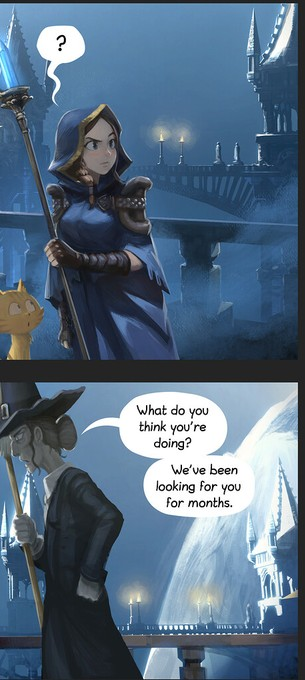
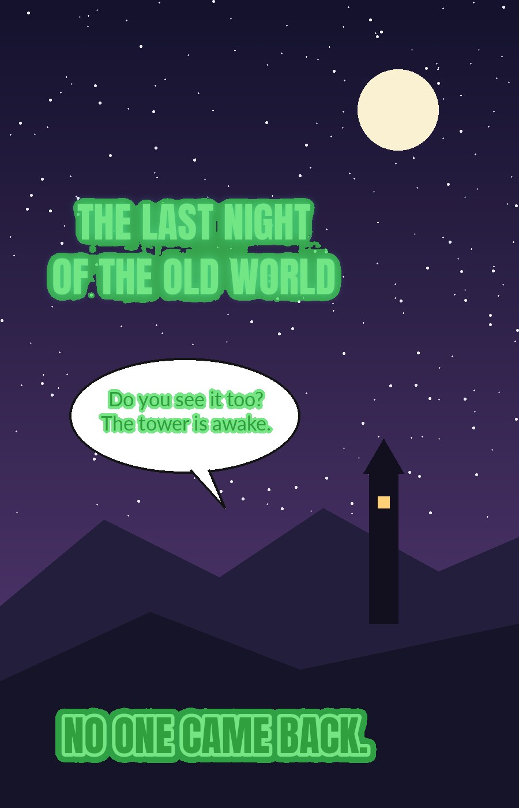

# Manga & Webtoon Translator Studio

**A local-first manga, manhwa, manhua, and webtoon translation & lettering studio.**

Detect text, clean artwork, OCR, translate, typeset, review, render, and export complete chapters — while keeping the editor in control of the final result.

**Import → Slice → Detect → Clean → Review → OCR → Translate → Letter → Render → Export**

### What the cleanup does

  
  
  

An original test page (drawn for this README, not taken from any series) through the app: RAW → erase mask → CLEAN. The glowing caption, the speech bubble and the white-outlined narration are gone; the bubble outline, stars, moon and tower stay.

### Measured on real chapters

Same GitHub runner, whole chapters, both cleaners side by side (evidence on the `audit-evidence` branch):

| | Old hand-tuned masks | Current masks |
| --- | --- | --- |
| Webtoon, 36 pages, 243 text blocks | 763 s, missed a glowing title | **562 s (26 % faster)**, no story text left |
| Manga oneshot, 39 pages, 158 blocks | 301 s, clean | 382 s, clean |
| Shadow Slave ch.1 in the app, 135 slices | 403–934 s, 5 blocks with text left | **451 s, 1** (the edge of the series logo) |
| Labelled synthetic text: erased / precision | 65.4 % / 43.1 % | **73.7 % / 73.1 %** |

- **Glow, outlines and shadows go with the letters**, while the bubble outline and the art stay.
- **Stylised sound effects are mostly left as art**: the letter model reads story lettering, not drawn SFX.
- **The mask model runs about 40× faster than the released one** with identical output (see [docs/detection.md](docs/detection.md)).
- **A restore brush** puts back any area the cleanup took by mistake, and the page keeps it through later repaints.

> **Automation proposes. Editorial state decides. Published artifacts must match the current state.**

## Why this project exists

Most automated manga translators treat a page as something to transform once.

This project treats a chapter as an **editable production workspace**.

Detection, cleanup, OCR, translation, typography, and AI assistance are all allowed to make mistakes. The editor can inspect, correct, reject, repaint, resize, retranslate, or restyle those results before anything becomes the published chapter artifact.

The application is local-first and CPU-oriented. Local ONNX models provide the core detection and inpainting pipeline; OCR and external AI providers are optional layers around that local workflow.

## The workflow

| Stage | What happens |
| --- | --- |
| **1. Import** | Images, ZIP/CBZ archives, or chapter URLs |
| **2. Slice** | Long webtoon pages become processing-friendly slices |
| **3. Detect** | Text blocks and a letter mask for each (letters, outlines, glow) |
| **4. Clean** | LaMa inpainting on letter masks, leftover passes, manual repair |
| **5. Review** | Unified canvas workspace and editorial corrections |
| **6. OCR** | MangaOCR + PP-OCRv6 hybrid recognition |
| **7. Translate** | Batch text translation or two-image vision translation |
| **8. Letter** | Text objects, geometry, typography, font matching |
| **9. Render** | Revision-safe page publication |
| **10. Export** | Stitched chapter ZIP |

## Features

### 📥 Import

- PNG, JPEG, WEBP and BMP
- ZIP and CBZ chapters
- Chapter URLs through HTTP and Playwright
- Relative URLs, srcset, common lazy-load attributes, and scroll-based discovery
- Site-specific downloader adapters where a stable fast path is useful
- Bounded downloads and upload validation

### ✂️ Smart webtoon slicing

Long pages are split into CPU-friendly slices without blindly cutting at a fixed height.

The slicer prefers low-content and safe bands, preserves source-page and slice identity, and records stitch ownership so a webtoon page can be reconstructed without duplicated or missing pixels.

### 🔎 Detection

The Kiuyha ONNX text detector (`models/kiuyha_text_1280.onnx`) finds text blocks on each slice in one coarse pass plus near-native bands. Each block then gets an erase mask:

- letters read by the mask head of comic-text-detector (`models/ctd_seg.onnx`), at full and half size
- a thin outline round every letter, even one the same colour as the background
- glow and shadow: smooth pixels unlike the colours round the block, grown out from the letters
- art touching the letters stays: growth that runs off the block is dropped
- text across a slice seam is detected once on a strip over the cut and joins the block it belongs to

Detection records retain source/model provenance and review state.

### 🧹 Artwork-safe cleanup

Cleanup is driven by **verified pixel masks**, not detector rectangles.

The pipeline supports:

- LaMa inpainting with a zeroed hole, and nearby text not erased yet hidden from its context
- one downscaled LaMa pass per region (512 px long side: the same fill, several times cheaper)
- leftover passes only for blocks where the letter model still reads text
- dynamic and fixed LaMa backends, with tiling for the fixed 512 model
- safe flat-fill shortcuts
- manual repaint
- a restore brush that puts the original page back where the cleanup went too far
- mask reset
- preserve/skip regions
- page-coordinate mask remapping

Uncertain detections, watermarks, and review-only regions are not silently promoted to destructive cleanup.

### 👁️ OCR

Hybrid chapter OCR uses:

- **MangaOCR** for Japanese
- **PP-OCRv6 / PaddleOCR** for Chinese, Korean, and English

OCR is chapter-aware, revision-safe, and can preserve source visual metadata such as lettering color, position, and size hints for downstream typesetting.

### 🌐 Translation

Two complementary modes are available.

**Text translation**

Batch existing text objects through configured OpenAI-compatible providers with stable IDs, stale-write protection, and provider-specific budget controls where pricing is known.

**Vision translation**

Send the **ORIGINAL** and **CLEAN** versions of the same slice together with existing text-object IDs and stored regions.

The model translates only the objects that already exist. Geometry, placement, color, and size remain editor-owned state rather than model-generated replacements.

### ✍️ Lettering

The browser workbench provides region-centric editing for:

- translated text
- font and size
- weight
- stroke
- background
- alignment
- text-region geometry
- manual text objects

The current UI is a unified Review workspace rather than a collection of legacy editor screens.

### 🔤 Automatic comic-font matching

The renderer includes a native catalog of **66 bundled OFL-1.1 comic fonts** across dialogue, emphasis, thought, narration, skill, SFX, horror, and romance categories.

Automatic font matching runs by default using deterministic CPU-side visual comparison of original lettering crops.

User and AI font choices are validated against the installed catalog instead of accepting arbitrary filesystem paths.

### 🧠 AI providers

Built-in providers currently include:

- Google Gemini
- DeepSeek
- OpenAI
- OpenRouter
- Experiential Labs

The settings layer can also register custom **OpenAI-compatible** providers with validated HTTPS API bases.

Providers advertise capabilities independently, allowing the same registry to power model discovery, translation, and Visual QC without hard-wiring the UI to one vendor.

### 🔍 Visual QC

Visual QC is an inspection layer, not the editor of record.

The system supports region-aware chapter inspection, revision-aware caching, bounded concurrency, cancel/retry flows, provider-isolated results, and browser-tested navigation of QC findings.

### 📦 Revision-safe render and export

Rendered pages and chapter exports are tied to canonical editorial state.

If an editor changes relevant content while expensive rendering or export work is running, stale artifacts are rejected instead of becoming the current published result.

Long webtoon slices are stitched back into their source-page structure during chapter export.

## Evidence

Every quality claim above comes from a bench run on real chapters, saved on the
`audit-evidence` branch with a side-by-side image per text block. The demo page
at the top (`docs/images/demo-*.jpg`) is an original drawing made for this
README; no series artwork is kept in the repository.

## Quick start

### Requirements

- Python 3.12
- CPU-capable machine
- Chromium for Playwright URL ingestion and browser regression checks
- Additional RAM is useful for OCR and very large pages

The image path accepts up to **100,000,000 decoded pixels** per image.

### Install

One command, nothing else to install first (it brings its own Python 3.12):

~~~powershell
# Windows: paste into PowerShell or cmd
powershell -ExecutionPolicy ByPass -c "irm https://raw.githubusercontent.com/tuantran00541-spec/manga-translator/main/install.ps1 | iex"
~~~

~~~bash
# Linux / macOS
curl -LsSf https://raw.githubusercontent.com/tuantran00541-spec/manga-translator/main/install.sh | sh
~~~

Then, in any **new** cmd or terminal window:

~~~bash
manga           # starts the app and opens it in the browser (or just opens it if it already runs)
manga update    # gets the latest version; models, chapters and settings stay
manga --version
~~~

What the installer does, in one folder (`%LOCALAPPDATA%\manga-translator` on Windows, `~/.local/share/manga-translator` elsewhere):

- downloads [uv](https://github.com/astral-sh/uv) (pinned, hash checked), which fetches Python 3.12 and installs the dependencies with CPU-only PyTorch;
- on Windows, installs the Microsoft Visual C++ runtime when it is missing or older than 14.40 (torch, onnxruntime and PaddleOCR need it; Windows asks for admin once). `manga` checks it again at every start, so a runtime removed later is put back instead of failing with WinError 126;
- downloads the LaMa model (hash checked, resumes broken downloads) and builds `ctd_seg.onnx`;
- adds a `manga` command to the user PATH. The first install downloads a few GB and needs about 8 GB free.

A Windows user folder with accents (for example `C:\Users\Nguyễn`) breaks PaddleOCR, so the installer then uses `C:\ProgramData\manga-translator` instead. From a clone, `install.bat` / `./install.sh` install that clone in place instead of downloading.

To uninstall, delete that folder and the `manga` command (`%LOCALAPPDATA%\manga-translator\bin` on Windows, `~/.local/bin/manga` elsewhere), then remove its line from the user Path or shell start-up file.

Manual install, if you prefer (Python 3.10–3.12):

~~~bash
python -m venv .venv
# Linux / macOS: source .venv/bin/activate    Windows: .\.venv\Scripts\Activate.ps1
python -m pip install -r requirements.txt
playwright install chromium
~~~

### Models

Place these files in models/:

| File | Purpose |
| --- | --- |
| kiuyha_text_1280.onnx | Text detection: Kiuyha/Manga-Bubble-YOLO boxes |
| ctd_seg.onnx | Letter masks: comic-text-detector, exported fast and mask-only |
| lama-manga-dynamic.onnx | Preferred inpainting backend |
| lama.onnx | Fixed-resolution fallback |

`kiuyha_text_1280.onnx` (10 MB) is in the repository; the LaMa files are too
large for Git and must be downloaded. Build `ctd_seg.onnx` from the released
[comictextdetector.pt.onnx](https://github.com/zyddnys/manga-image-translator/releases/tag/beta-0.3)
by saving it as `.cache/comictextdetector.pt.onnx` and running `python scripts/export_ctd_onnx.py`
(needs `torch`, `onnx` and `onnx2torch` once; the app itself only needs onnxruntime). The **Kiuyha ONNX export** workflow
re-exports
[Kiuyha/Manga-Bubble-YOLO](https://huggingface.co/Kiuyha/Manga-Bubble-YOLO)
and checks the ONNX boxes against the original model. See
[docs/detection.md](docs/detection.md) for how detection works and why.

### Run

~~~bash
manga             # after the installer
python run.py     # from an activated environment
~~~

Open:

~~~text
http://127.0.0.1:8000
~~~

### Docker

~~~bash
docker compose up --build
~~~

The Docker image expects model files through the mounted ./models directory.

## AI setup

Provider keys are configured independently in the settings UI or through environment variables:

~~~text
GEMINI_API_KEY
GOOGLE_API_KEY
DEEPSEEK_API_KEY
OPENAI_API_KEY
OPENROUTER_API_KEY
EXPLABS_API_KEY
~~~

The settings UI can discover provider models through /models, select exact model IDs, and register custom OpenAI-compatible providers.

Custom provider endpoints must use public HTTPS URLs. Credentials are never accepted inside the API URL.

### Manga Cloud (experimental, off by default)

Every feature, A.I mode included, is free with your own A.I key. Manga Cloud is for people without one: with `MANGA_TIERS=1` the app offers a Manga Cloud provider served by the gateway at `MANGA_CLOUD_URL`. Users sign in from the A.I mode panel with their email and a 6-digit code, top up a prepaid balance, and each A.I call of a chapter is charged at its real cost plus a 5% fee (`GATEWAY_FEE_PERCENT`). A long webtoon chapter costs about $0.30, so a chapter needs about $0.32 of balance to start. Payment-provider fees are added to what the user pays, so the balance always gets the full top-up. The gateway stops a chapter at what the balance can pay for, and at $2 whatever the balance.

A.I mode runs a chapter through four checkpoints, each with its own prompt:

1. Scan the raw slices: skip credit and textless slices, keep series logos untouched.
2. Clean the text (Kiuyha + LaMa).
3. Compare each raw and clean slice: erase missed text, repaint leftovers, restore art erased by mistake.
4. Translate each slice from its raw and clean image and pick fonts; the app letters the text.

The lettered chapter then opens in the editor, where it can be fixed by hand and exported.

The gateway lives in `gateway/` and runs with `python -m gateway`. [docs/DEPLOY.md](docs/DEPLOY.md) puts it online behind Caddy with HTTPS, and lists its limits and admin commands:

| Area | Variables |
| --- | --- |
| A.I upstream | `GATEWAY_UPSTREAM_BASE`, `GATEWAY_UPSTREAM_KEY`, `GATEWAY_UPSTREAM_MODEL`, `GATEWAY_PRICE_INPUT_PER_M`, `GATEWAY_PRICE_OUTPUT_PER_M` |
| Login email | `GATEWAY_RESEND_API_KEY`, `GATEWAY_MAIL_FROM`, `GATEWAY_DEV_LOGIN=1` (shows the code instead of mailing it, local testing only) |
| Wallet | `GATEWAY_FEE_PERCENT` (5), `GATEWAY_CHAPTER_ESTIMATE_USD` (0.30), `GATEWAY_VND_PER_USD` (26000), `GATEWAY_TOPUPS_VND`, `GATEWAY_TOPUPS_USD` |
| payOS (VietQR) | `GATEWAY_PAYOS_CLIENT_ID`, `GATEWAY_PAYOS_API_KEY`, `GATEWAY_PAYOS_CHECKSUM_KEY`, `GATEWAY_PAYOS_FEE_PERCENT` (0); webhook `/v1/billing/payos/webhook` |
| Lemon Squeezy (cards) | `GATEWAY_LS_API_KEY`, `GATEWAY_LS_STORE_ID`, `GATEWAY_LS_VARIANT`, `GATEWAY_LS_WEBHOOK_SECRET`, `GATEWAY_LS_FEE_PERCENT` (5), `GATEWAY_LS_FEE_FIXED_USD` (0.50); webhook `/v1/billing/lemonsqueezy/webhook` |
| Other | `GATEWAY_DB`, `GATEWAY_ADMIN_KEY`, `GATEWAY_RETURN_URL`, `GATEWAY_HOST`, `GATEWAY_PORT`, `GATEWAY_TRUSTED_PROXIES` |

Signed-in users see their balance and every top-up and chapter charge, sign out on every device and delete their account from the A.I mode panel. A payOS top-up is credited once when its webhook reports the exact amount. A Lemon Squeezy top-up is a one-time order at a custom price on one product variant; its refund takes the credit back.

## Runtime settings

Detection, inpainting, OCR and rendering thresholds are fixed constants in `app/parameters.py`. Only operational settings read environment variables:

| Area | Variables |
| --- | --- |
| Processing | `MANGA_PIPELINE_DEFAULT_WORKERS`, `MANGA_PIPELINE_SLICE_WORKER_LIMIT`, `MANGA_USE_DYNAMIC_LAMA`, `MANGA_INPAINT_PRELOAD`, `MANGA_FIXED_LAMA_*` |
| ONNX Runtime | `MANGA_ORT_PROVIDER`, `MANGA_ORT_REQUIRE_PROVIDER`, `MANGA_ORT_INTRA_OP_THREADS`, `MANGA_ORT_OPENVINO_*`, `MANGA_ORT_CPU_MEM_ARENA`, `MANGA_ORT_MEM_PATTERN`, `MANGA_ORT_SERIALIZE_INFERENCE` |
| OCR | `MANGA_PPOCRV6_TIER`, `MANGA_PPOCRV6_TEXTLINE_ORIENTATION`, `MANGA_OCR_TARGET_SELECTION`, `MANGA_OCR_IMAGE_CACHE_MB`, `MANGA_OCR_JOB_CONCURRENCY_LIMIT`, `MANGA_OCR_JOB_ACTIVE_LIMIT` |
| Access | `MANGA_ALLOWED_HOSTS`: extra host names the app answers to, comma separated (loopback always works; add the machine's LAN name or IP to open it from another device) |
| Network and AI | `MANGA_DOWNLOAD_WORKERS`, `MANGA_DOWNLOAD_JS_NAVIGATION_TIMEOUT_MS`, `MANGA_REMOTE_CONNECT_TIMEOUT_SECONDS`, `MANGA_TRANSLATION_CONNECT_TIMEOUT_SECONDS`, `MANGA_TRANSLATION_READ_TIMEOUT_SECONDS`, `MANGA_VISUAL_QC_*` |

## CPU-first design

The supported baseline is CPU execution.

The runtime has been optimized around bounded desktop-class workloads instead of assuming a GPU:

- bounded page concurrency
- conservative ONNX Runtime threading
- OpenVINO on supported x86-64 Windows/Linux systems
- standard ONNX Runtime elsewhere
- decoded-page caching for repeated OCR work
- bounded downloads and transient retries
- short manifest lock windows
- deterministic browser/runtime checks

The default production processing schedule is intentionally small enough to avoid multiplying heavy inference kernels until the machine becomes memory- or bandwidth-bound.

GPU acceleration is not required for the core workflow.

## Safety by design

Safety is part of the processing model, not just deployment hardening.

The application protects:

- remote URL imports against SSRF and unsafe address ranges
- managed files against path escape
- uploads and archives against oversized payloads
- decoded images against excessive pixel counts
- browser requests against unsafe remote targets
- custom AI endpoints against invalid/untrusted URLs
- rendered/exported artifacts against stale editor state

Network-exposed deployments still need normal firewall and authentication controls.

## Architecture

At a high level:

~~~text
                    Browser Workbench
                          │
                       FastAPI
                          │
        ┌─────────────────┼─────────────────┐
        │                 │                 │
        ▼                 ▼                 ▼
   Processing         Editorial           AI
    Pipeline            State          Providers
        │                 │                 │
 Detect · OCR ·      Text · Geometry    Translate · QC
 Inpaint · Render    · Typography
        └─────────────────┼─────────────────┘
                          ▼
                  Revision-safe artifacts
                          │
                          ▼
                   Stitched ZIP export
~~~

For implementation details see [docs/ARCHITECTURE.md](docs/ARCHITECTURE.md).

## Documentation

The README is intentionally product-focused. Deeper engineering material lives in docs/.

- [Architecture](docs/ARCHITECTURE.md)
- [Security history](docs/SECURITY_HISTORY.md)
- [Text detection](docs/detection.md)
- [Comic font library](docs/comic-fonts.md)
- [UI guidelines](docs/UI_GUIDELINES.md)

## Development

Install test dependencies:

~~~bash
python -m pip install -r requirements-test.txt
~~~

Useful commands:

~~~bash
make test
make test-browser
make health
make release-check
make docker-up
~~~

The maintained release path covers source compilation, regression tests, browser/runtime checks, OCR and provider contracts, mask authority, geometry/revision safety, long-image behavior, and the connected product flow:

**processed page → OCR/text object → translation → render → chapter ZIP**

Model-dependent validation remains a separate local artifact gate because production ONNX binaries are not stored in Git.

To clean a whole real chapter with the real models and see speed and text left behind, run the **Chapter run** workflow from the Actions tab; results go to the `audit-evidence` branch.

## Project layout

~~~text
app/
  detector/       text detection (Kiuyha) and masks
  downloader/     HTTP, Playwright, adapters and slicing
  inpaint/        LaMa and mask geometry safety
  ocr/            MangaOCR + PP-OCRv6
  translation/    text and two-image vision translation
  render/         typography, font catalog and matching
  visual_qc/      visual inspection and provider orchestration
  routers/        FastAPI API surface
  static/         browser workbench
  pipeline*.py    chapter processing and runtime coordination
  manifest_utils.py
  editorial_gate.py
  security.py

tests/            correctness and release regressions
models/           local model artifacts
data/             runtime chapter data
docs/             maintained engineering documentation
scripts/          release, browser and sanity tooling
~~~

## Current limitations

This project is designed to accelerate chapter production, not eliminate every form of professional redraw and lettering work.

Manual intervention is still expected for:

- difficult artwork reconstruction
- perspective or heavily warped lettering
- curved/path text
- complex hand-drawn SFX recreation
- ambiguous OCR
- heavily protected reader sites
- typography requiring artistic judgment

The strongest use case is a **reviewable production workstation with automation**, not a black-box batch converter.

## Project philosophy

The repository has evolved through security hardening, end-to-end product closure, detector/inpaint safety work, hybrid OCR, CPU throughput work, a unified Review workspace, revision-safe rendering/export, Visual QC, native font matching, configurable AI providers, and vision translation.

Those features all reinforce the same rule:

> **The page belongs to the editor.**

Automation can detect it, clean it, read it, translate it, suggest a font, or inspect it — but the current editorial state remains authoritative until the final artifact is published.

## License

See the repository license and bundled asset metadata for software and font licensing details.
