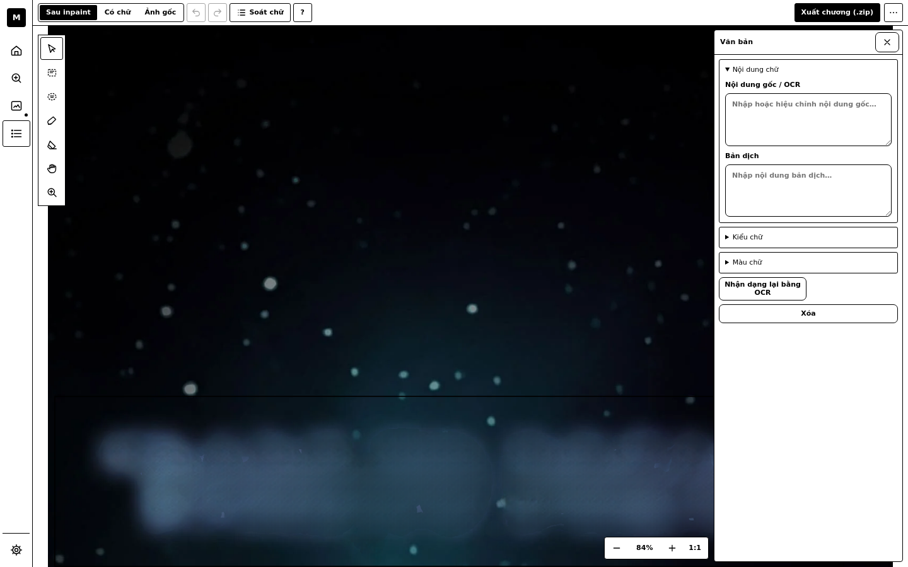
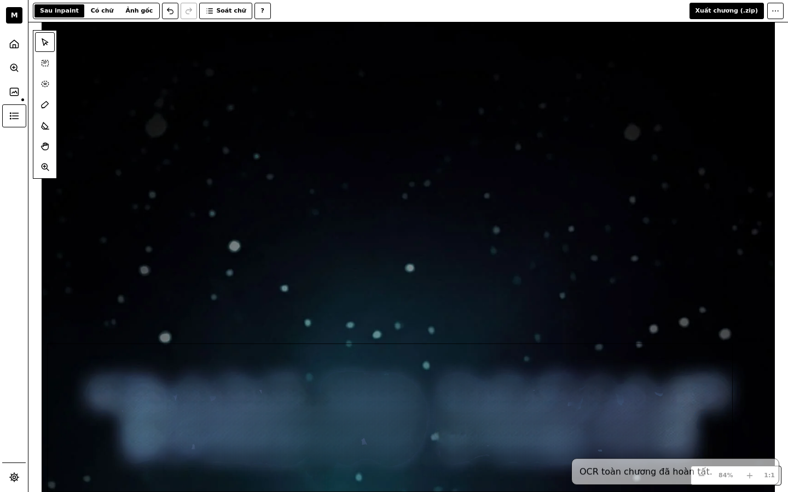
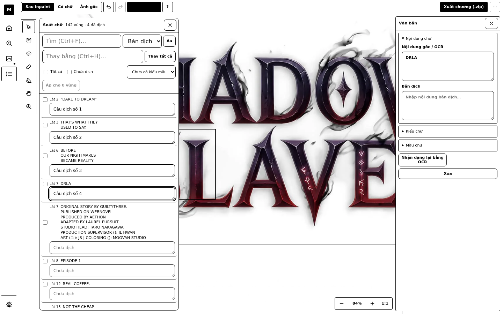
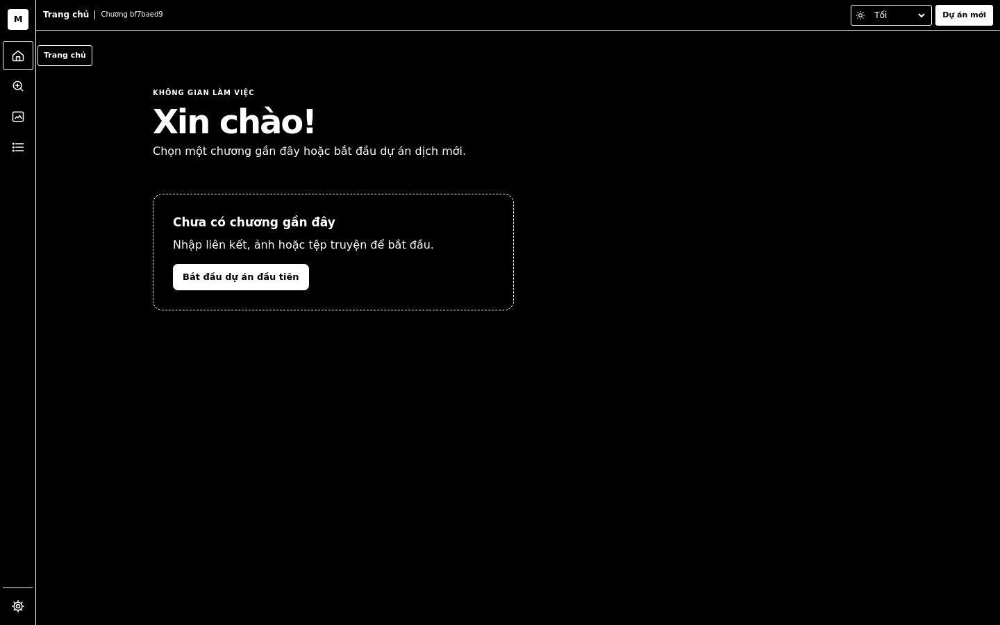
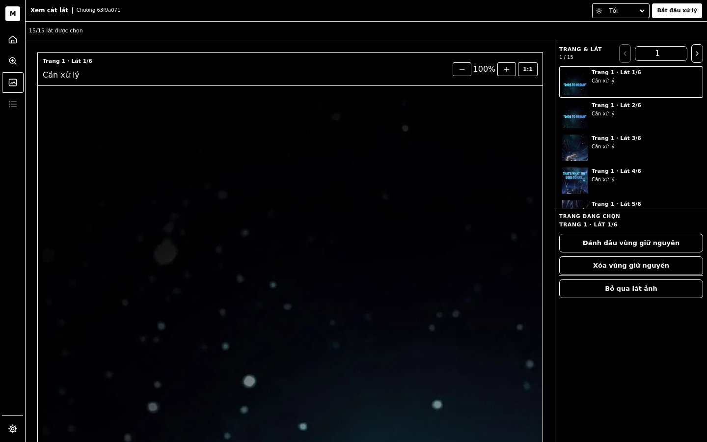
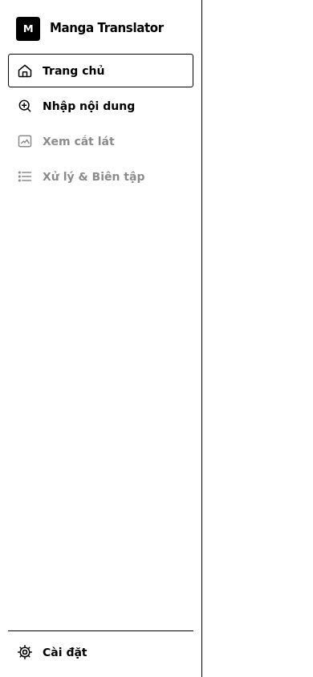
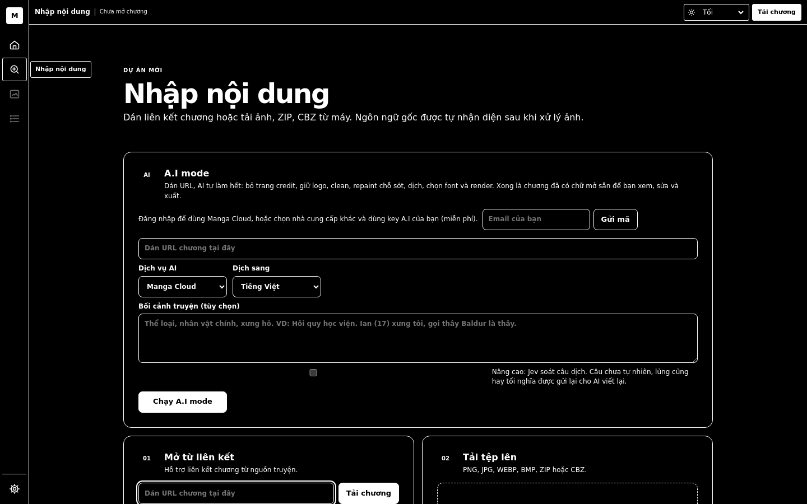
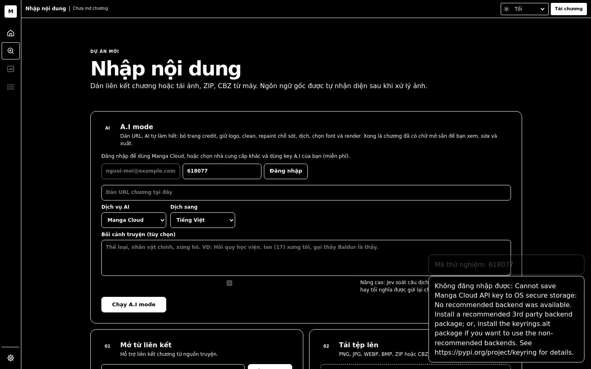

# First-use walkthrough

## OK · home · 1.5s
- home text: KHÔNG GIAN LÀM VIỆC
Xin chào!

Chọn một chương gần đây hoặc bắt đầu dự án dịch mới.

Chưa có chương gần đây

Nhập liên kết, ảnh hoặc tệp truyện để bắt đầu.

Bắt đầu dự án đầu tiên

## OK · open-import · 0.7s
- import text: DỰ ÁN MỚI
Nhập nội dung

Dán liên kết chương hoặc tải ảnh, ZIP, CBZ từ máy. Ngôn ngữ gốc được tự nhận diện sau khi xử lý ảnh. | A.I mode | Mở từ liên kết | Tải tệp lên

## OK · load-chapter-from-link · 16.8s
- 'Tải chương' buttons on screen: 2
- preview header: Chương bf7baed9 | 135/135 lát được chọn
- slices listed: 135

## OK · preview-browse-and-skip · 2.8s
- after skip: 134/135 lát được chọn
- after restore: 135/135 lát được chọn

## OK · preview-preserve-region · 2.0s
- inspector: TRANG ĐANG CHỌN
TRANG 1 · LÁT 3/6
Đang đánh dấu · Chọn để kết thúc
Xóa vùng giữ nguyên
Bỏ qua lát ảnh

## OK · process-chapter · 432.0s
- progress text: Đang xử lý 0/135…
- progress text: Đang xử lý 5/135…
- progress text: Đang xử lý 26/135…
- progress text: Đang xử lý 48/135…
- progress text: Đang xử lý 73/135…
- progress text: Đang xử lý 95/135…
- progress text: Đang xử lý 116/135…
- text regions on screen: 0

## OK · review-views · 5.4s

## OK · tool-tooltips · 0.8s
- tools in rail: 7

## OK · select-bubble · 25.1s
- OCR text of first region: ''

## OK · type-translation · 1.5s
- save status: 

## OK · ocr-whole-chapter · 142.5s
- OCR panel: 
- toast: OCR toàn chương đã hoàn tất.

## OK · proof-panel · 4.7s
- rows in proof panel: 142
- rows matching 'số': 4

## OK · draw-new-region · 2.9s
- regions before/after drawing: 142/143

## OK · undo-redo · 3.1s
- regions after undo: 142
- regions after redo: 143

## OK · style-preset · 1.7s
- toast: Đã lưu kiểu "Lời thoại đậm".

## OK · brush-clean · 3.3s

## OK · lettered-view · 7.3s
- lettered view ready after 7.1s

## FAIL · export · 0.2s
- FAILED: AttributeError: 'builtin_function_or_method' object has no attribute '_pw_impl_instance_'

## OK · keyboard-help · 0.7s

## OK · settings · 1.8s
- settings: Cài đặt
Dịch vụ AI

API key được giữ trong kho bí mật của hệ điều hành.

Chưa có dịch vụ nào được kết nối
Mặc định
Google Gemini
DeepSeek
OpenAI
OpenRouter
Google Gemini
Chưa có key
DeepSeek
Chưa có key
OpenAI
Chưa có key
OpenRouter
Chưa có key
+ Thêm provider tùy chỉnh

## OK · back-home-recent · 1.1s
- home text: KHÔNG GIAN LÀM VIỆC
Xin chào!

Chọn một chương gần đây hoặc bắt đầu dự án dịch mới.

Chưa có chương gần đây

Nhập liên kết, ảnh hoặc tệp truyện để bắt đầu.

Bắt đầu dự án đầu tiên

## FAIL · dark-theme · 30.9s
- theme picker visible in the editor: True
- FAILED: TimeoutError: Locator.click: Timeout 30000ms exceeded.
Call log:
waiting for locator(".recent-card").first

## OK · upload-zip · 4.3s
- uploaded 3 images; preview: 15/15 lát được chọn

## OK · mobile-home · 1.3s

## OK · mobile-open-recent · 5.2s

## OK · ai-mode-first-look · 2.3s
- A.I panel: AI
A.I mode

Dán URL, AI tự làm hết: bỏ trang credit, giữ logo, clean, repaint chỗ sót, dịch, chọn font và render. Xong là chương đã có chữ mở sẵn để bạn xem, sửa và xuất.

Đăng nhập để dùng Manga Cloud, hoặc chọn nhà cung cấp khác và dùng key A.I của bạn (miễn phí).
Email
Gửi mã
Liên kết chương cho A.I mode
Dịch vụ AI
Manga Cloud
Google Gemini
DeepSeek
OpenAI
OpenRouter
Dịch sang
Tiếng Việt
English
Bahasa Indonesia
Español
Português
Français
Deutsch
Bối cảnh truyện (tùy chọn)
Nâng cao: Jev soát câu dịch. Câu chưa tự nhiên, lủng củng hay tối nghĩa được gửi lại cho AI viết lại.
Chạy A.I mode

## OK · ai-mode-sign-in · 3.7s
- code toast: ['Mã thử nghiệm: 618077']
- plan bar: Đăng nhập để dùng Manga Cloud, hoặc chọn nhà cung cấp khác và dùng key A.I của bạn (miễn phí).
Email
Mã 6 số
Đăng nhập
- toast: Mã thử nghiệm: 618077
- toast: Không đăng nhập được: Cannot save Manga Cloud API key to OS secure storage: No recommended backend was available. Install a recommended 3rd party backend package; or, install the keyrings.alt package if you want to use the non-recommended backends. See https://pypi.org/project/keyring for details.
- console error: Failed to load resource: the server responded with a status of 503 (Service Unavailable)

## OK · ai-mode-top-up-simulated · 2.1s
- plan bar after $1 credit: Đăng nhập để dùng Manga Cloud, hoặc chọn nhà cung cấp khác và dùng key A.I của bạn (miễn phí).
Email
Gửi mã

## OK · ai-mode-run · 60.4s
- provider picked: manga-cloud
- 30s: Mở chươngHủy
              Báo cáo của AI
- finished after 60s: Mở chươngHủy
              Báo cáo của AI
- toast: Không chạy được A.I mode: Chưa đăng nhập Manga Cloud
- console error: Failed to load resource: the server responded with a status of 401 (Unauthorized)

## FAIL · ai-mode-open-result · 30.1s
- FAILED: TimeoutError: Locator.click: Timeout 30000ms exceeded.
Call log:
waiting for locator("#ai-mode-open")
  -   locator resolved to <button hidden="" type="button" id="ai-mode-open" class="ui-btn ui-btn-primary">Mở chương</button>
  - attempting click action
  -   waiting for element to be visible, enabled and stable
  -   element is not visible
  - retrying click action, attempt #1
  -   waiting for element to be 

