# First-use walkthrough

## OK · home · 0.8s
- home text: KHÔNG GIAN LÀM VIỆC
Xin chào!

Chọn một chương gần đây hoặc bắt đầu dự án dịch mới.

Chưa có chương gần đây

Nhập liên kết, ảnh hoặc tệp truyện để bắt đầu.

Bắt đầu dự án đầu tiên

## OK · open-import · 0.7s
- import text: DỰ ÁN MỚI
Nhập nội dung

Dán liên kết chương hoặc tải ảnh, ZIP, CBZ từ máy. Ngôn ngữ gốc được tự nhận diện sau khi xử lý ảnh. | A.I mode | Mở từ liên kết | Tải tệp lên

## OK · load-chapter-from-link · 16.0s
- 'Tải chương' buttons on screen: 1
- preview header: Chương 2304ccf6 | 135/135 lát được chọn
- slices listed: 135

## OK · preview-browse-and-skip · 2.8s
- after skip: 134/135 lát được chọn
- after restore: 135/135 lát được chọn

## OK · preview-preserve-region · 2.0s
- inspector: TRANG ĐANG CHỌN
TRANG 1 · LÁT 3/6
Đang đánh dấu · Chọn để kết thúc
Xóa vùng giữ nguyên
Bỏ qua lát ảnh

## OK · process-chapter · 611.1s
- progress text: Đang xử lý 0/135…
- progress text: Đang xử lý 0/135…
- progress text: Đang xử lý 14/135…
- progress text: Đang xử lý 26/135…
- progress text: Đang xử lý 41/135…
- progress text: Đang xử lý 54/135…
- progress text: Đang xử lý 77/135…
- progress text: Đang xử lý 93/135…
- progress text: Đang xử lý 108/135…
- progress text: Đang xử lý 122/135…
- text regions on screen: 0

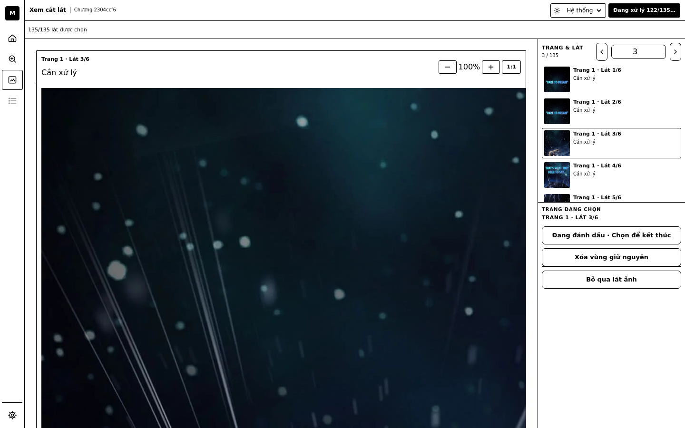

## OK · auto-ocr · 194.8s
- OCR finished by itself: True
- toast: Đang nhận dạng chữ gốc của cả chương, xem tiến độ ở menu ba chấm góc phải.
- toast: OCR toàn chương đã hoàn tất.

## OK · review-views · 5.4s
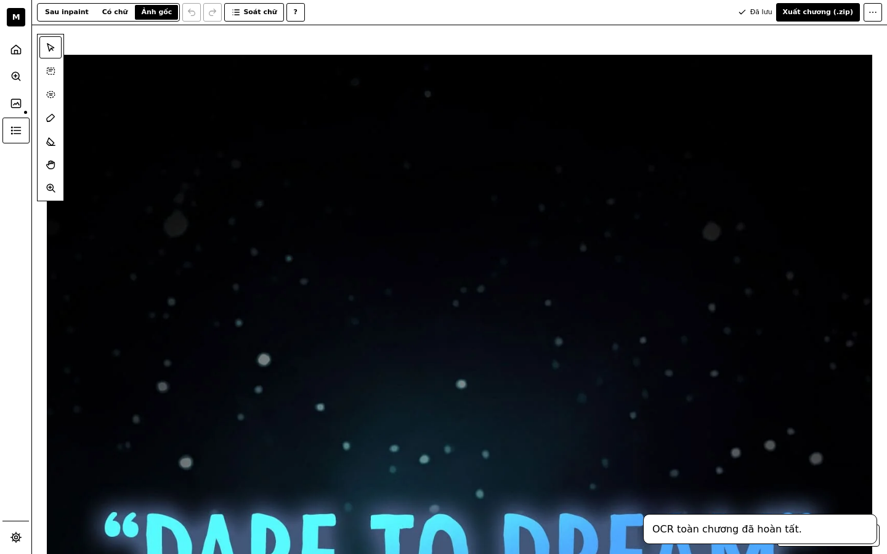

## OK · tool-tooltips · 0.8s
- tools in rail: 7
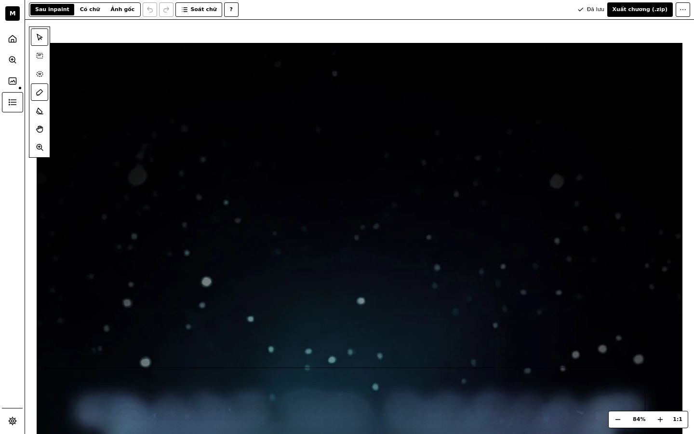

## OK · select-bubble · 1.1s
- OCR text of first region: '“DARE TO DREAM”'

## OK · type-translation · 1.5s
- save status: Đã lưu

## OK · ocr-whole-chapter · 0.7s
- menu: Ngôn ngữ gốc
Chưa rõ
Tiếng Nhật
Tiếng Trung
Tiếng Hàn
Tiếng Anh
tự nhận
OCR toàn chương
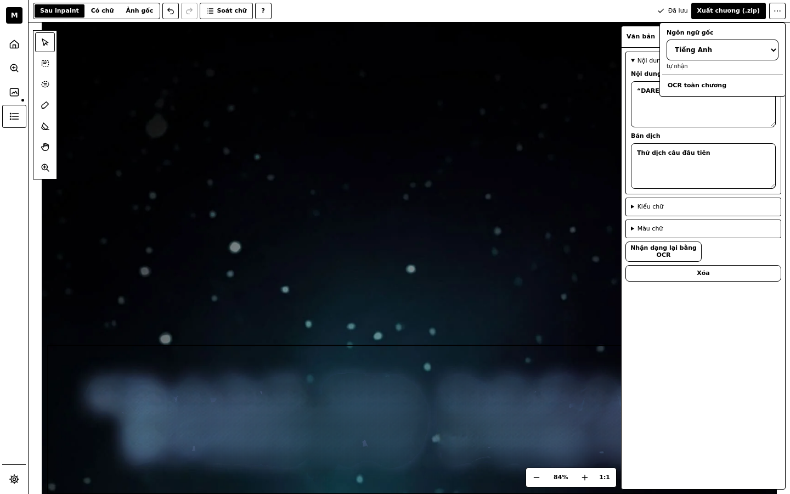

## OK · proof-panel · 4.7s
- rows in proof panel: 142
- rows matching 'số': 4
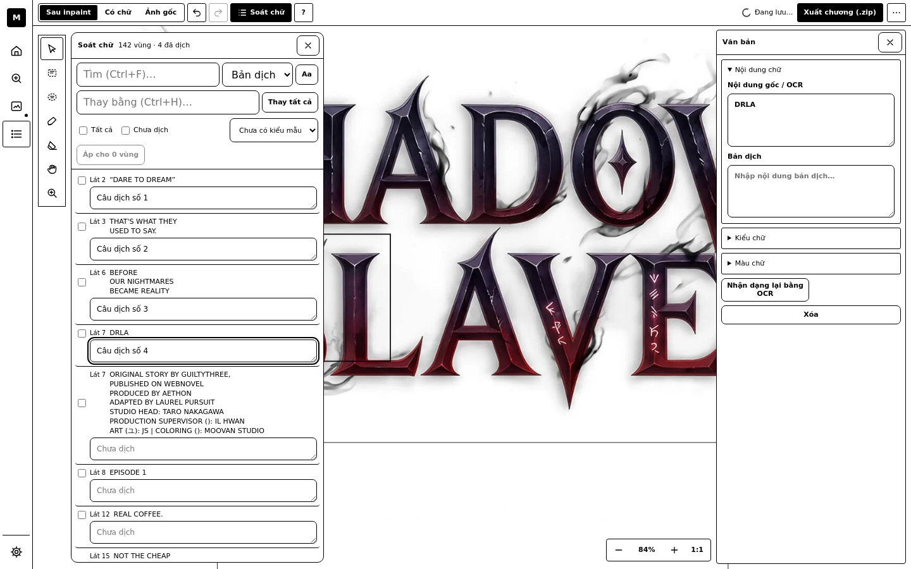

## OK · draw-new-region · 2.9s
- regions before/after drawing: 142/143
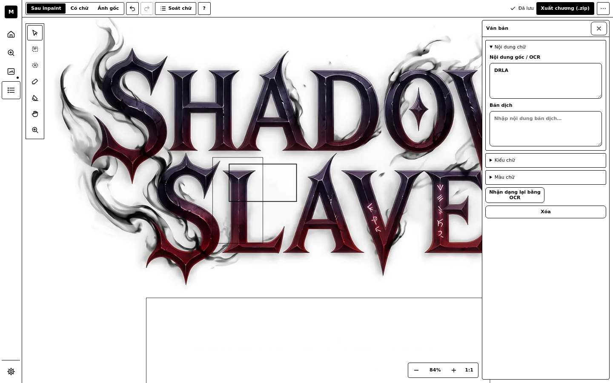

## OK · undo-redo · 3.1s
- regions after undo: 142
- regions after redo: 143

## OK · style-preset · 1.8s
- toast: Đã lưu kiểu "Lời thoại đậm".
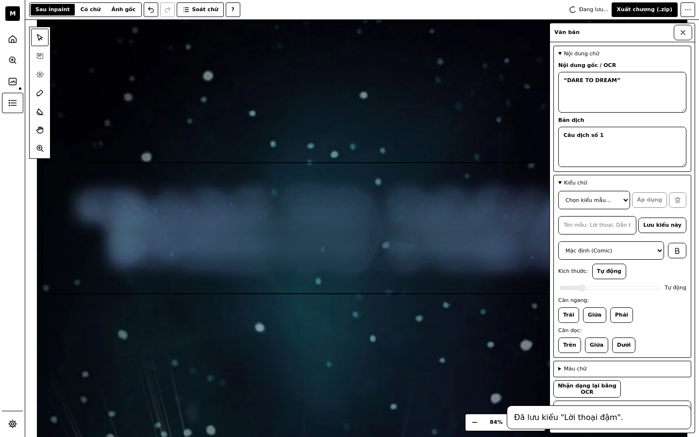

## OK · brush-clean · 3.4s

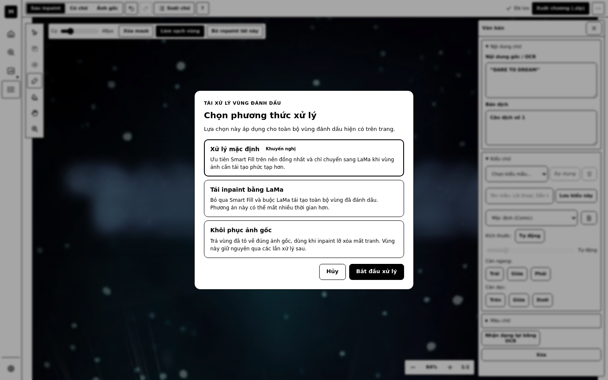

## OK · lettered-view · 7.3s
- lettered view ready after 7.1s
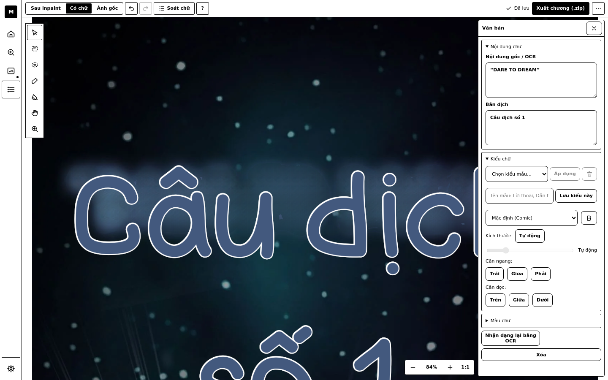

## OK · export · 167.1s
- zip has 43 files: ['page_001.png', 'page_002.png', 'page_003.png', 'page_004.png', 'page_005.png']
- toast: Đã kết xuất 131 trang.
- console error: Failed to load resource: the server responded with a status of 409 (Conflict)
- console error: dialog: Chương còn 136 vùng chưa dịch, 1 vùng chưa có chữ gốc.
Vẫn xuất chương? Những vùng đó sẽ để trống chữ.

## OK · keyboard-help · 0.7s
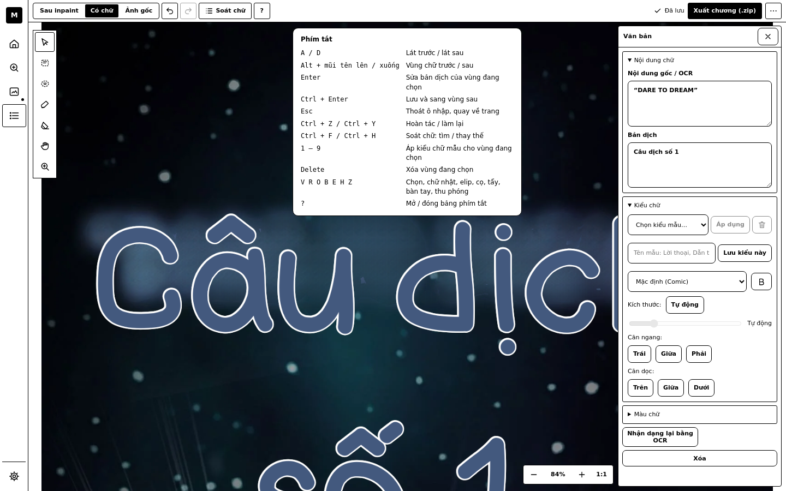

## OK · settings · 1.8s
- settings: Cài đặt
Dịch vụ AI

API key được giữ trong kho bí mật của hệ điều hành.

Chưa có dịch vụ nào được kết nối
Mặc định
Google Gemini
DeepSeek
OpenAI
OpenRouter
Google Gemini
Chưa có key
DeepSeek
Chưa có key
OpenAI
Chưa có key
OpenRouter
Chưa có key
+ Thêm provider tùy chỉnh
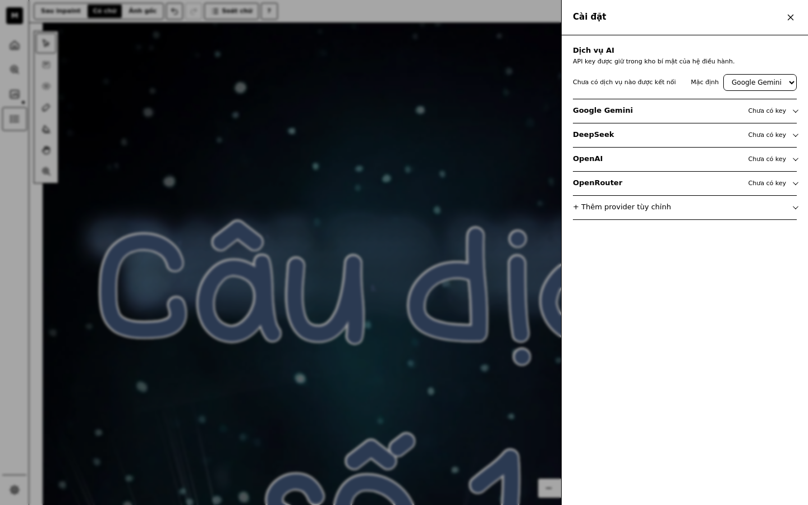

## OK · back-home-recent · 1.2s
- home text: KHÔNG GIAN LÀM VIỆC
Xin chào!

Chọn một chương gần đây hoặc bắt đầu dự án dịch mới.

Dự án gần đây
1
https://asurascans.com/comics/shadow-slave-05c7df14/chapter/1
135 trang ·
Kiểm tra chất lượng
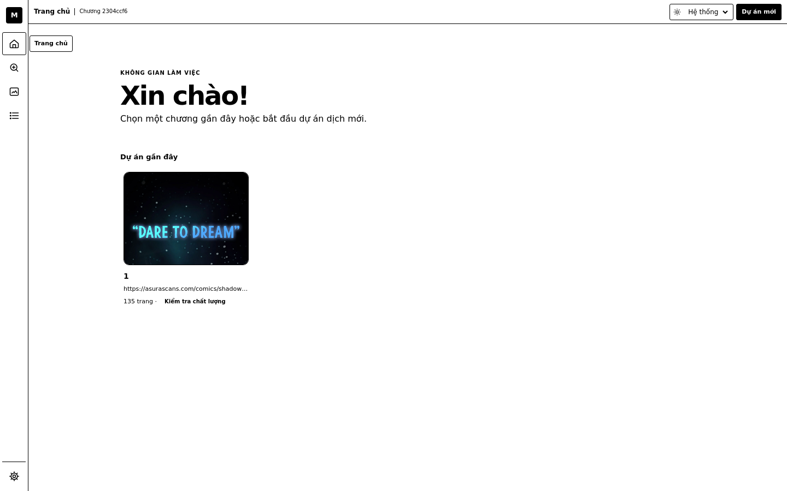

## OK · dark-theme · 7.7s
- theme picker visible in the editor: True
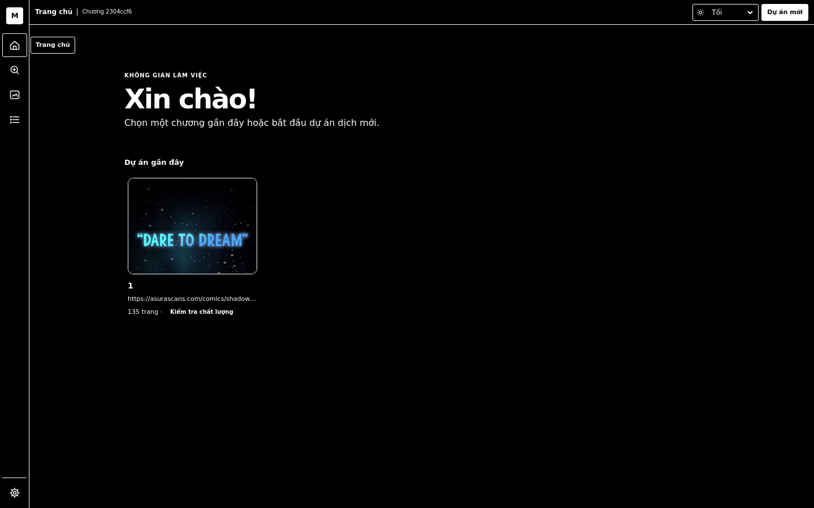
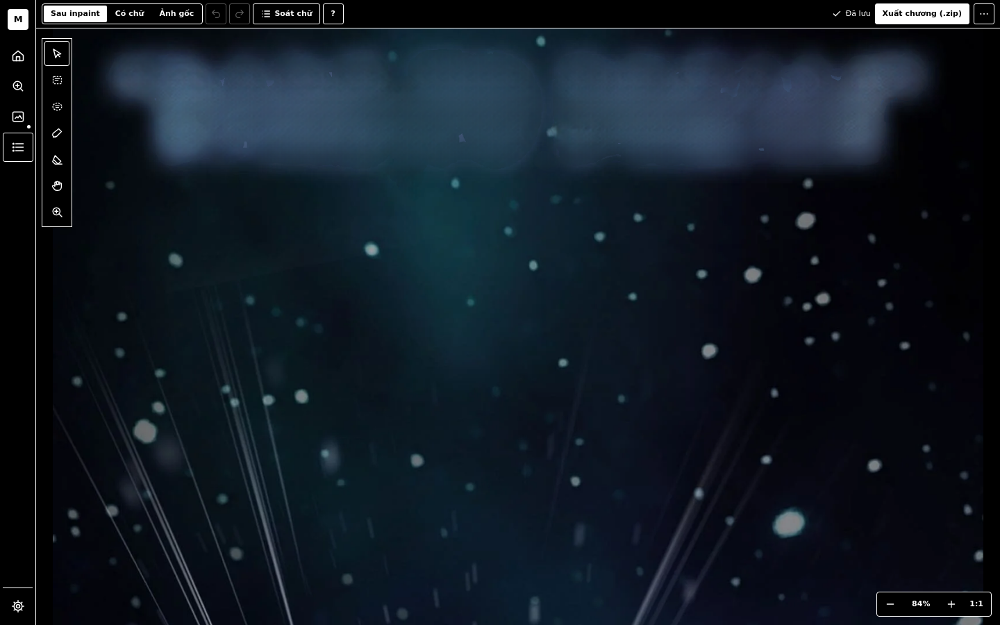

## OK · upload-zip · 5.3s
- uploaded 3 images; preview: 15/15 lát được chọn
- console error: Failed to load resource: the server responded with a status of 400 (Bad Request)
- console error: Failed to load resource: the server responded with a status of 400 (Bad Request)
- console error: Failed to load resource: the server responded with a status of 400 (Bad Request)
- console error: Failed to load resource: the server responded with a status of 400 (Bad Request)
- console error: Failed to load resource: the server responded with a status of 400 (Bad Request)
- console error: Failed to load resource: the server responded with a status of 400 (Bad Request)
- console error: Failed to load resource: the server responded with a status of 400 (Bad Request)
- console error: Failed to load resource: the server responded with a status of 400 (Bad Request)
- console error: Failed to load resource: the server responded with a status of 400 (Bad Request)
- console error: Failed to load resource: the server responded with a status of 400 (Bad Request)
- console error: Failed to load resource: the server responded with a status of 400 (Bad Request)
- console error: Failed to load resource: the server responded with a status of 400 (Bad Request)
- console error: Failed to load resource: the server responded with a status of 400 (Bad Request)
- console error: Failed to load resource: the server responded with a status of 400 (Bad Request)
- console error: Failed to load resource: the server responded with a status of 400 (Bad Request)
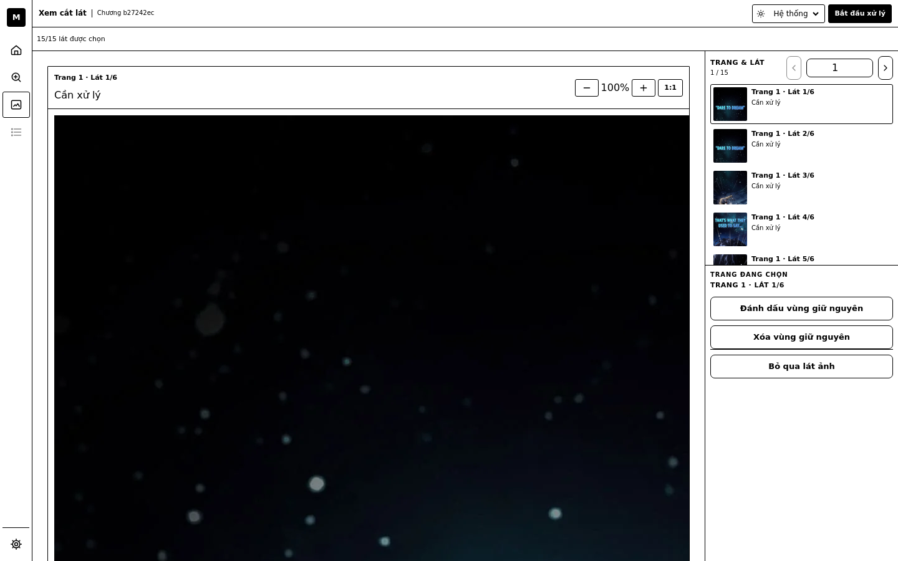

## OK · mobile-home · 1.3s
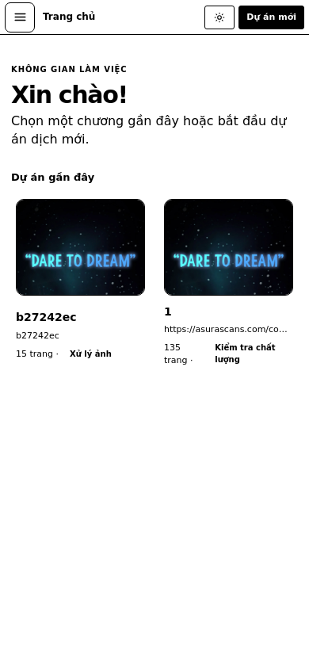
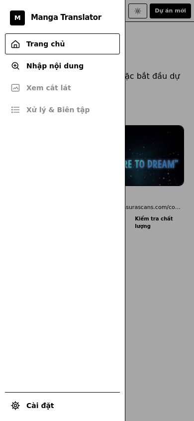

## OK · mobile-open-recent · 5.1s
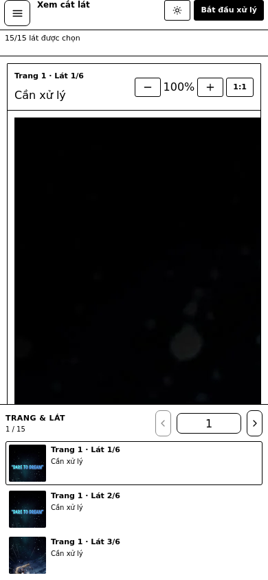

## OK · ai-mode-first-look · 2.3s
- A.I panel: AI
A.I mode

Dán URL, AI tự làm hết: bỏ trang credit, giữ logo, clean, repaint chỗ sót, dịch, chọn font và render. Xong là chương đã có chữ mở sẵn để bạn xem, sửa và xuất.

Đăng nhập để dùng Manga Cloud, hoặc chọn nhà cung cấp khác và dùng key A.I của bạn (miễn phí).
Email
Gửi mã
Liên kết chương cho A.I mode
Dịch vụ AI
Manga Cloud
Google Gemini
DeepSeek
OpenAI
OpenRouter
Dịch sang
Tiếng Việt
English
Bahasa Indonesia
Español
Português
Français
Deutsch
Bối cảnh truyện (tùy chọn)
Nâng cao: Jev soát câu dịch. Câu chưa tự nhiên, lủng củng hay tối nghĩa được gửi lại cho AI viết lại.
Chạy A.I mode
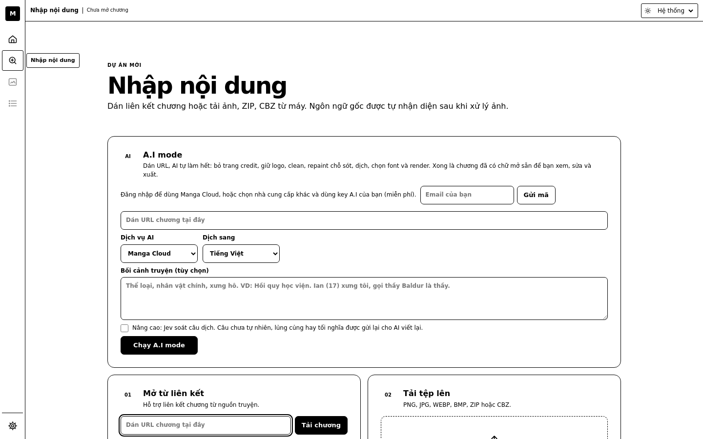

## OK · ai-mode-sign-in · 3.7s
- code toast: ['Mã thử nghiệm: 012373']
- plan bar: nguoi-moi@example.com · Số dư $0.00 (≈ 0 chương)
Tài khoản
- toast: Mã thử nghiệm: 012373
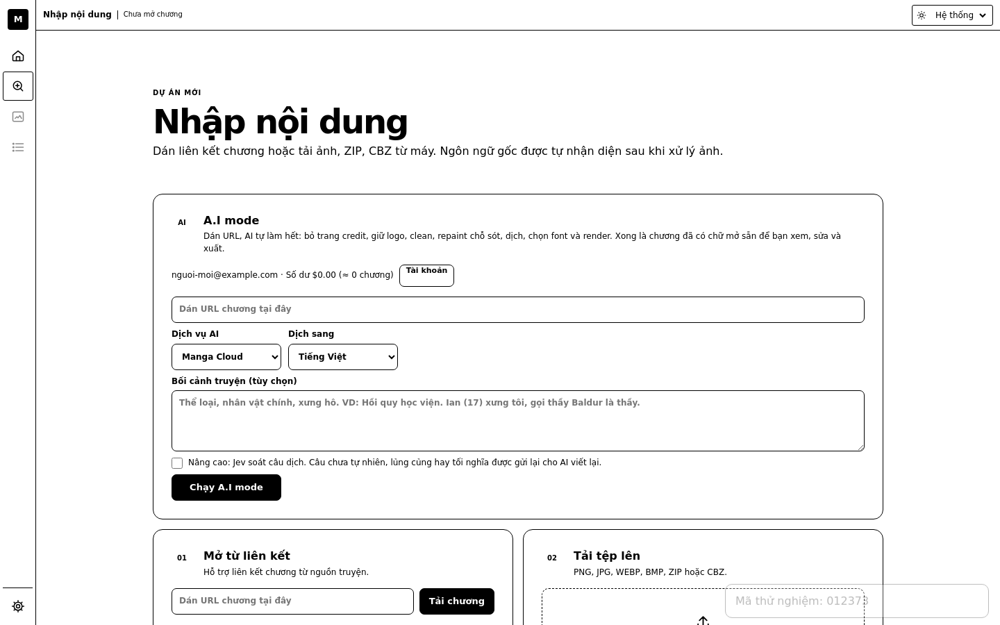

## OK · ai-mode-top-up-simulated · 2.1s
- plan bar after $1 credit: nguoi-moi@example.com · Số dư $1.00 (≈ 3 chương)
Tài khoản

## OK · ai-mode-run · 69.5s
- provider picked: manga-cloud
- 30s: Tải chương
Đang chạy 0/1 · Đang tải ảnh từ nguồn
Checkpoint 1: AI bỏ lát credit, lát trống và giữ logo
Chờ
Checkpoint 2: Clean ảnh
Chờ
Checkpoint 3: AI so ảnh gốc và ảnh clean
Chờ
Checkpoint 4: Dịch và chọn font
Chờ
Nâng cao: Jev soát câu dịch
Chờ
Render
Chờ
Hoàn tất
Chờ

AI đang làm, bạn có thể để trang này mở hoặc quay lại sau.

Hủy
- finished after 69s: Tải chương
Lỗi · Đang tải ảnh từ nguồn
Checkpoint 1: AI bỏ lát credit, lát trống và giữ logo
Chờ
Checkpoint 2: Clean ảnh
Chờ
Checkpoint 3: AI so ảnh gốc và ảnh clean
Chờ
Checkpoint 4: Dịch và chọn font
Chờ
Nâng cao: Jev soát câu dịch
Chờ
Render
Chờ
Hoàn tất
Chờ

Dừng vì lỗi: Download chapter failed: 429 Client Error: Too Many Requests for url: https://cdn.asurascans.com/asura-images/chapters/shadow-slave/2/f2a2df.webp?v=1787241989

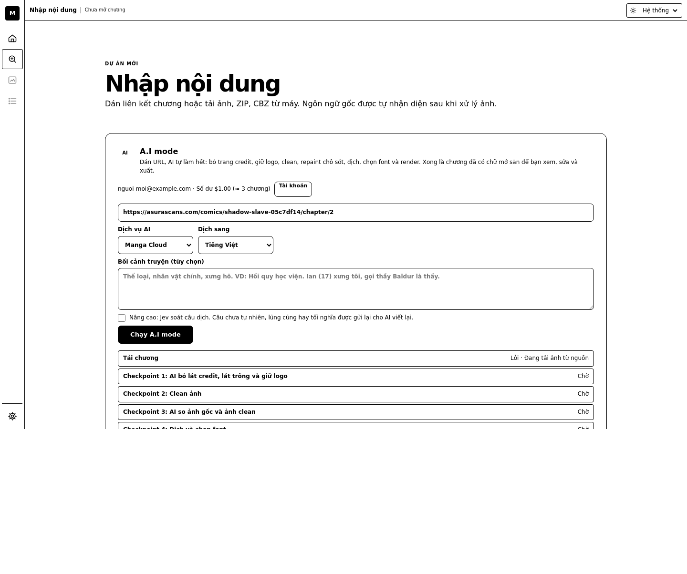

## FAIL · ai-mode-open-result · 30.1s
- FAILED: TimeoutError: Locator.click: Timeout 30000ms exceeded.
Call log:
waiting for locator("#ai-mode-open")
  -   locator resolved to <button hidden="" type="button" id="ai-mode-open" class="ui-btn ui-btn-primary">Mở chương</button>
  - attempting click action
  -   waiting for element to be visible, enabled and stable
  -   element is not visible
  - retrying click action, attempt #1
  -   waiting for element to be 
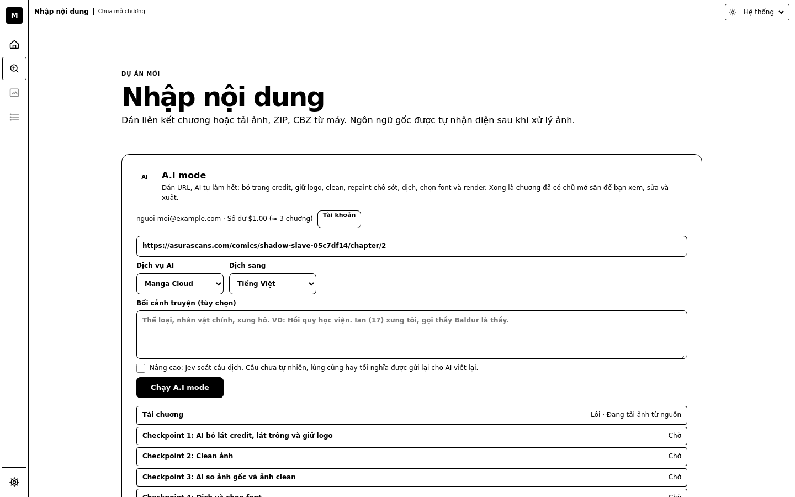
