# First-use walkthrough

## OK · home · 0.7s
- home text: KHÔNG GIAN LÀM VIỆC
Xin chào!

Chọn một chương gần đây hoặc bắt đầu dự án dịch mới.

Chưa có chương gần đây

Nhập liên kết, ảnh hoặc tệp truyện để bắt đầu.

Bắt đầu dự án đầu tiên

## OK · open-import · 0.6s
- import text: DỰ ÁN MỚI
Nhập nội dung

Dán liên kết chương hoặc tải ảnh, ZIP, CBZ từ máy. Ngôn ngữ gốc được tự nhận diện sau khi xử lý ảnh. | A.I mode | Mở từ liên kết | Tải tệp lên
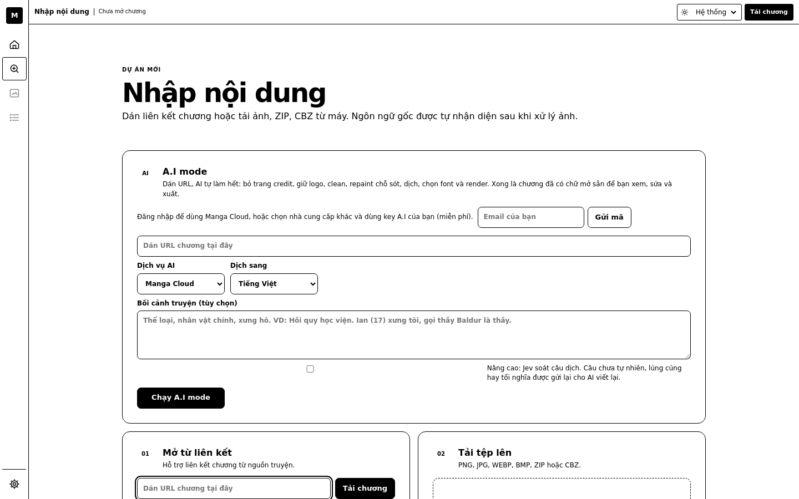

## OK · load-chapter-from-link · 10.7s
- 'Tải chương' buttons on screen: 2
- preview header: Chương 198e8397 | 135/135 lát được chọn
- slices listed: 135

## OK · preview-browse-and-skip · 2.6s
- after skip: 134/135 lát được chọn
- after restore: 135/135 lát được chọn

## OK · preview-preserve-region · 1.9s
- inspector: TRANG ĐANG CHỌN
TRANG 1 · LÁT 3/6
Đang đánh dấu · Chọn để kết thúc
Xóa vùng giữ nguyên
Bỏ qua lát ảnh
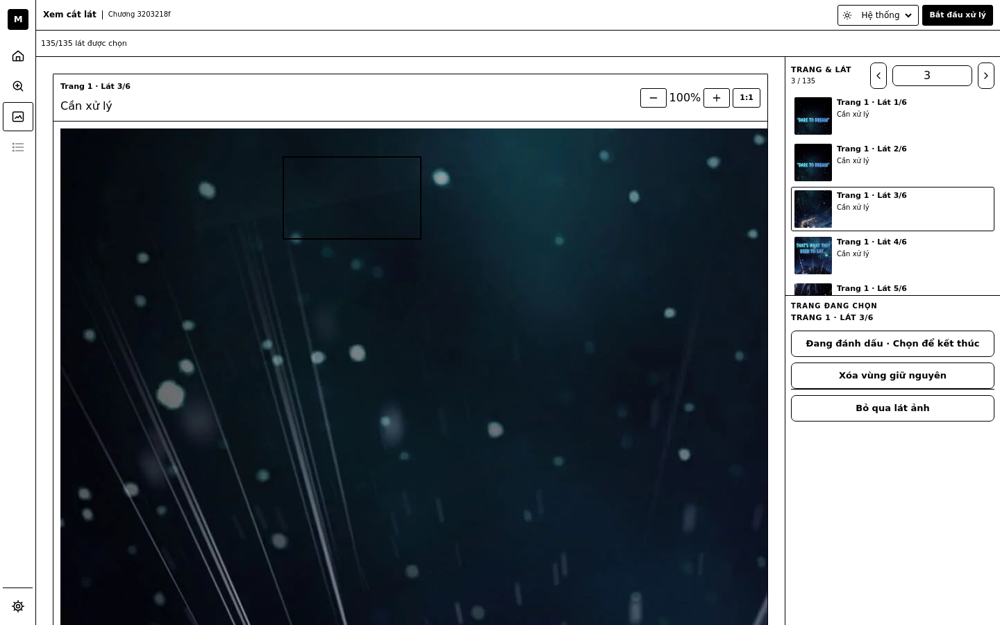

## OK · process-chapter · 267.3s
- progress text: Đang xử lý 0/135…
- progress text: Đang xử lý 23/135…
- progress text: Đang xử lý 56/135…
- progress text: Đang xử lý 98/135…
- text regions on screen: 0

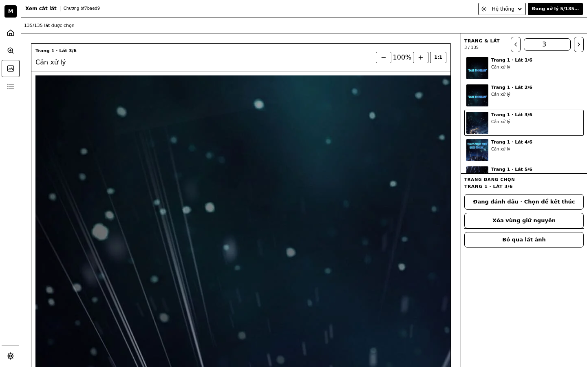

## OK · review-views · 5.3s

## OK · tool-tooltips · 0.8s
- tools in rail: 7

## OK · select-bubble · 7.9s
- OCR text of first region: ''

## OK · type-translation · 1.5s
- save status: 

## OK · ocr-whole-chapter · 84.1s
- OCR panel: 
- toast: OCR toàn chương đã hoàn tất.

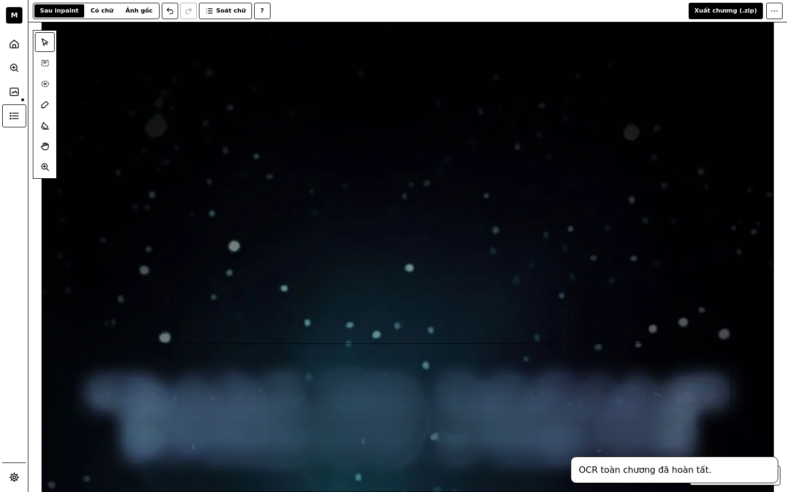

## OK · proof-panel · 4.5s
- rows in proof panel: 142
- rows matching 'số': 4

## OK · draw-new-region · 2.8s
- regions before/after drawing: 142/143

## OK · undo-redo · 3.1s
- regions after undo: 142
- regions after redo: 143

## OK · style-preset · 1.6s
- toast: Đã lưu kiểu "Lời thoại đậm".

## OK · brush-clean · 3.0s
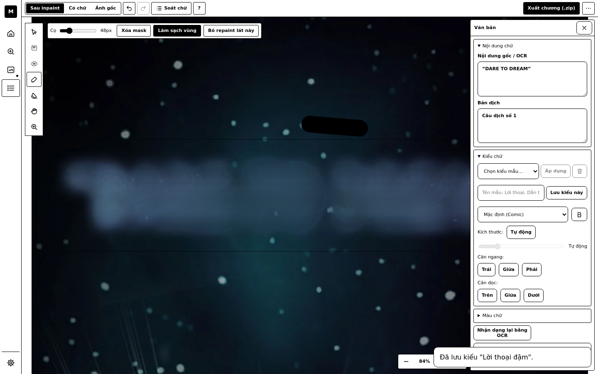
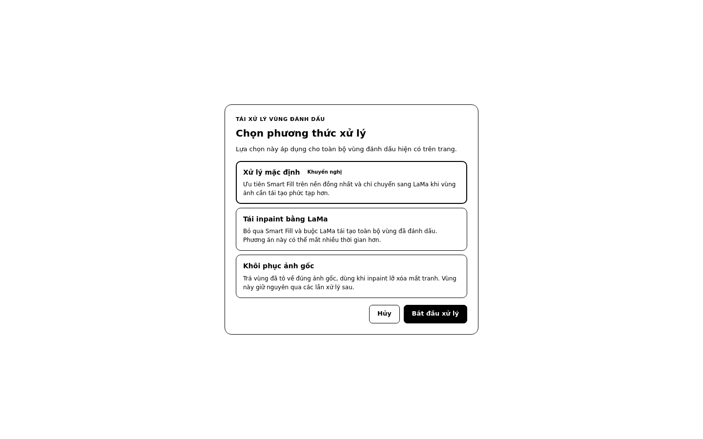

## OK · lettered-view · 5.2s
- lettered view ready after 5.1s

## FAIL · export · 1.3s
- FAILED: RuntimeError: no file was downloaded
- toast: Xuất chương thất bại: Editorial preflight blocked final render/export: 137 unresolved story-text blocker(s): untranslated_story_object@p1:text_388b3959a5f141d9, untranslated_story_object@p4:text_ef87c2b2f101430b, untranslated_story_object@p5:text_6a01f9abd1ef4cf6, untranslated_story_object@p12:text_e4f2e5635faa4ba9, untranslated_story_object@p15:text_1cdb6d3142724a62, +132 more
- console error: Failed to load resource: the server responded with a status of 409 (Conflict)

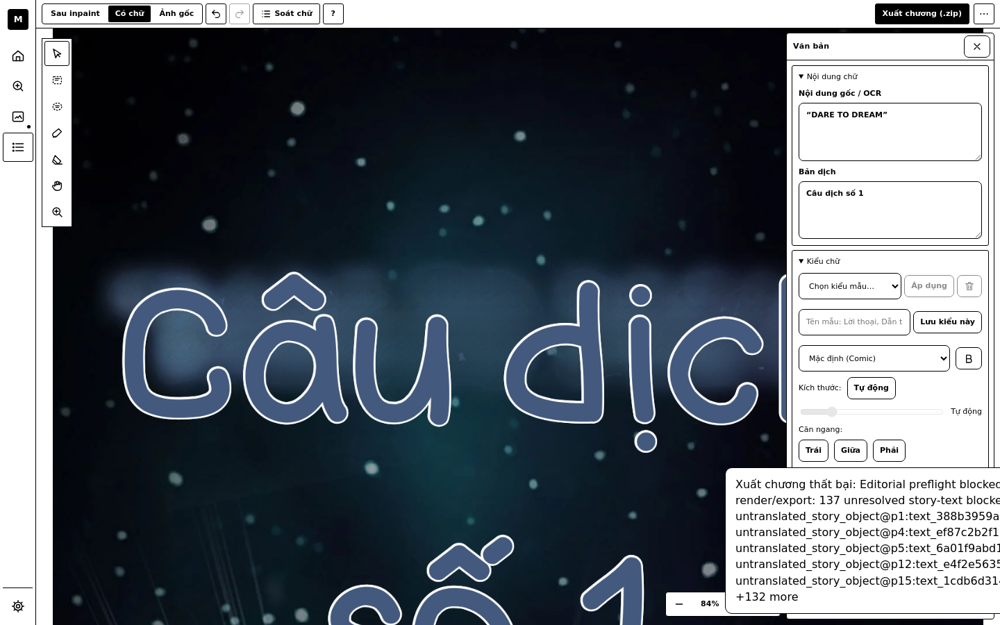

## OK · keyboard-help · 0.6s
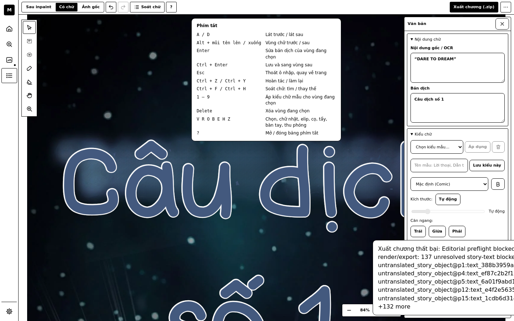

## OK · settings · 1.6s
- settings: Cài đặt
Dịch vụ AI

API key được giữ trong kho bí mật của hệ điều hành.

Chưa có dịch vụ nào được kết nối
Mặc định
Google Gemini
DeepSeek
OpenAI
OpenRouter
Google Gemini
Chưa có key
DeepSeek
Chưa có key
OpenAI
Chưa có key
OpenRouter
Chưa có key
+ Thêm provider tùy chỉnh
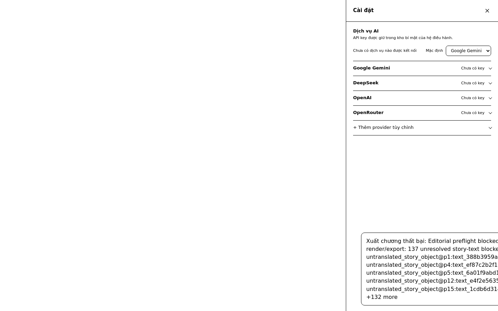

## OK · back-home-recent · 1.1s
- home text: KHÔNG GIAN LÀM VIỆC
Xin chào!

Chọn một chương gần đây hoặc bắt đầu dự án dịch mới.

Chưa có chương gần đây

Nhập liên kết, ảnh hoặc tệp truyện để bắt đầu.

Bắt đầu dự án đầu tiên
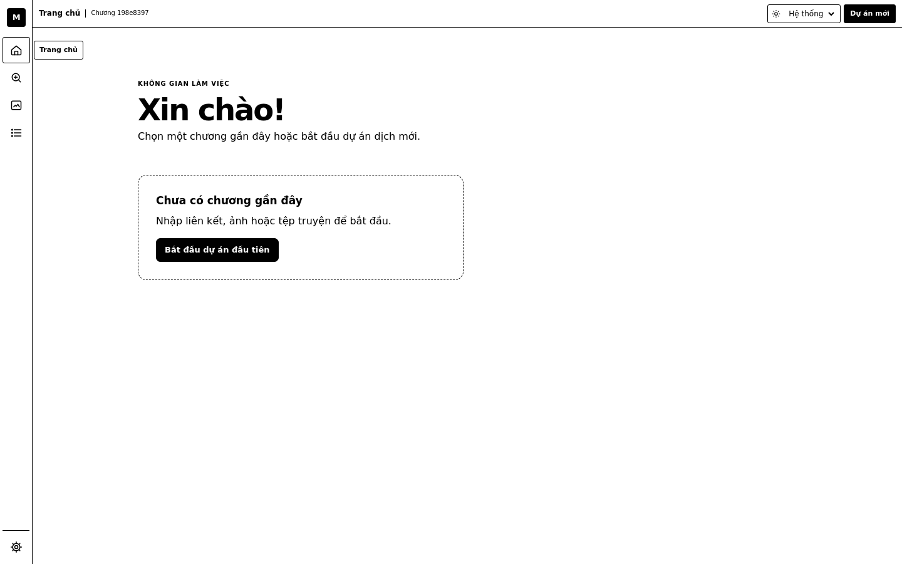

## OK · dark-theme · 7.5s
- theme picker visible in the editor: True

## OK · upload-zip · 4.3s
- uploaded 3 images; preview: 15/15 lát được chọn

## OK · mobile-home · 1.2s
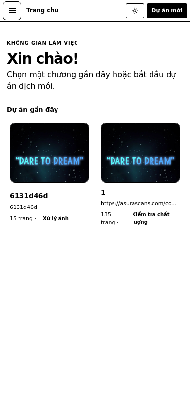

## OK · mobile-open-recent · 5.1s

## OK · ai-mode-first-look · 2.2s
- A.I panel: AI
A.I mode

Dán URL, AI tự làm hết: bỏ trang credit, giữ logo, clean, repaint chỗ sót, dịch, chọn font và render. Xong là chương đã có chữ mở sẵn để bạn xem, sửa và xuất.

Đăng nhập để dùng Manga Cloud, hoặc chọn nhà cung cấp khác và dùng key A.I của bạn (miễn phí).
Email
Gửi mã
Liên kết chương cho A.I mode
Dịch vụ AI
Manga Cloud
Google Gemini
DeepSeek
OpenAI
OpenRouter
Dịch sang
Tiếng Việt
English
Bahasa Indonesia
Español
Português
Français
Deutsch
Bối cảnh truyện (tùy chọn)
Nâng cao: Jev soát câu dịch. Câu chưa tự nhiên, lủng củng hay tối nghĩa được gửi lại cho AI viết lại.
Chạy A.I mode
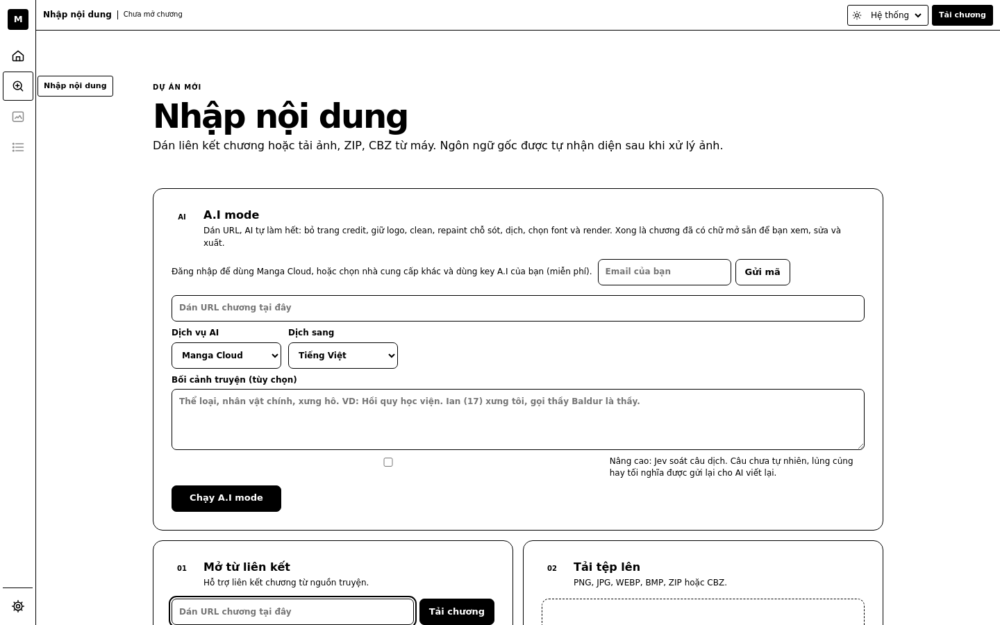

## OK · ai-mode-sign-in · 3.6s
- code toast: ['Mã thử nghiệm: 947362']
- plan bar: nguoi-moi@example.com · Số dư $0.00 (≈ 0 chương)
Tài khoản
- toast: Mã thử nghiệm: 947362
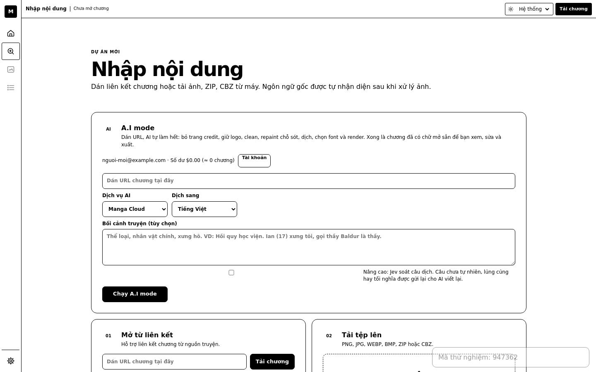

## OK · ai-mode-top-up-simulated · 2.1s
- plan bar after $1 credit: nguoi-moi@example.com · Số dư $1.00 (≈ 3 chương)
Tài khoản

## OK · ai-mode-run · 931.2s
- provider picked: manga-cloud
- 30s: Tải chương
Xong · 160 lát · 10s
Checkpoint 1: AI bỏ lát credit, lát trống và giữ logo
Đang chạy 18/160
Checkpoint 2: Clean ảnh
Chờ
Checkpoint 3: AI so ảnh gốc và ảnh clean
Chờ
Checkpoint 4: Dịch và chọn font
Chờ
Nâng cao: Jev soát câu dịch
Chờ
Render
Chờ
Hoàn tất
Chờ

AI đang làm, bạn có thể để trang này mở hoặc quay lại sau.

Hủy
- 151s: Tải chương
Xong · 160 lát · 10s
Checkpoint 1: AI bỏ lát credit, lát trống và giữ logo
Xong · 1 lát credit, 28 lát không chữ, 1 logo · 1p33s
Checkpoint 2: Clean ảnh
Đang chạy 18/131
Checkpoint 3: AI so ảnh gốc và ảnh clean
Chờ
Checkpoint 4: Dịch và chọn font
Chờ
Nâng cao: Jev soát câu dịch
Chờ
Render
Chờ
Hoàn tất
Chờ

AI đang làm, bạn có thể để trang này mở hoặc quay lại sau.

Hủy
- 272s: Tải chương
Xong · 160 lát · 10s
Checkpoint 1: AI bỏ lát credit, lát trống và giữ logo
Xong · 1 lát credit, 28 lát không chữ, 1 logo · 1p33s
Checkpoint 2: Clean ảnh
Đang chạy 82/131
Checkpoint 3: AI so ảnh gốc và ảnh clean
Chờ
Checkpoint 4: Dịch và chọn font
Chờ
Nâng cao: Jev soát câu dịch
Chờ
Render
Chờ
Hoàn tất
Chờ

AI đang làm, bạn có thể để trang này mở hoặc quay lại sau.

Hủy
- 393s: Tải chương
Xong · 160 lát · 10s
Checkpoint 1: AI bỏ lát credit, lát trống và giữ logo
Xong · 1 lát credit, 28 lát không chữ, 1 logo · 1p33s
Checkpoint 2: Clean ảnh
Xong · 4p12s
Checkpoint 3: AI so ảnh gốc và ảnh clean
Đang chạy 131/131
Checkpoint 4: Dịch và chọn font
Chờ
Nâng cao: Jev soát câu dịch
Chờ
Render
Chờ
Hoàn tất
Chờ

AI đang làm, bạn có thể để trang này mở hoặc quay lại sau.

Hủy
- 513s: Tải chương
Xong · 160 lát · 10s
Checkpoint 1: AI bỏ lát credit, lát trống và giữ logo
Xong · 1 lát credit, 28 lát không chữ, 1 logo · 1p33s
Checkpoint 2: Clean ảnh
Xong · 4p12s
Checkpoint 3: AI so ảnh gốc và ảnh clean
Xong · 15 tờ crop, repaint 13 · 1p19s
Checkpoint 4: Dịch và chọn font
Đang chạy 26/131
Nâng cao: Jev soát câu dịch
Chờ
Render
Chờ
Hoàn tất
Chờ

AI đang làm, bạn có thể để trang này mở hoặc quay lại sau.

Hủy
- 633s: Tải chương
Xong · 160 lát · 10s
Checkpoint 1: AI bỏ lát credit, lát trống và giữ logo
Xong · 1 lát credit, 28 lát không chữ, 1 logo · 1p33s
Checkpoint 2: Clean ảnh
Xong · 4p12s
Checkpoint 3: AI so ảnh gốc và ảnh clean
Xong · 15 tờ crop, repaint 13 · 1p19s
Checkpoint 4: Dịch và chọn font
Đang chạy 51/131
Nâng cao: Jev soát câu dịch
Chờ
Render
Chờ
Hoàn tất
Chờ

AI đang làm, bạn có thể để trang này mở hoặc quay lại sau.

Hủy
- 754s: Tải chương
Xong · 160 lát · 10s
Checkpoint 1: AI bỏ lát credit, lát trống và giữ logo
Xong · 1 lát credit, 28 lát không chữ, 1 logo · 1p33s
Checkpoint 2: Clean ảnh
Xong · 4p12s
Checkpoint 3: AI so ảnh gốc và ảnh clean
Xong · 15 tờ crop, repaint 13 · 1p19s
Checkpoint 4: Dịch và chọn font
Đang chạy 81/131
Nâng cao: Jev soát câu dịch
Chờ
Render
Chờ
Hoàn tất
Chờ

AI đang làm, bạn có thể để trang này mở hoặc quay lại sau.

Hủy
- 874s: Tải chương
Xong · 160 lát · 10s
Checkpoint 1: AI bỏ lát credit, lát trống và giữ logo
Xong · 1 lát credit, 28 lát không chữ, 1 logo · 1p33s
Checkpoint 2: Clean ảnh
Xong · 4p12s
Checkpoint 3: AI so ảnh gốc và ảnh clean
Xong · 15 tờ crop, repaint 13 · 1p19s
Checkpoint 4: Dịch và chọn font
Đang chạy 128/131
Nâng cao: Jev soát câu dịch
Chờ
Render
Chờ
Hoàn tất
Chờ

AI đang làm, bạn có thể để trang này mở hoặc quay lại sau.

Hủy
- finished after 931s: Tải chươngXong · 160 lát · 10sCheckpoint 1: AI bỏ lát credit, lát trống và giữ logoXong · 1 lát credit, 28 lát không chữ, 1 logo · 1p33sCheckpoint 2: Clean ảnhXong · 4p12sCheckpoint 3: AI so ảnh gốc và ảnh cleanXong · 15 tờ crop, repaint 13 · 1p19sCheckpoint 4: Dịch và chọn fontXong · Dịch 117 vùng · 7p40sNâng cao: Jev soát câu dịchXong · Tắt · 0sRenderXong · 34sHoàn tấtXong · Xong · 0s
              Xong! Chương đã có chữ, mở ra để xem, sửa và xuất.
              Mở chươngHủy
              Báo cáo của AIBỏ qua 1 lát credit: lát 160Bỏ qua 28 lát không có chữ (giữ ảnh gốc)Giữ nguyên 1 vùng logo
- toast: A.I mode xong, đang mở chương.
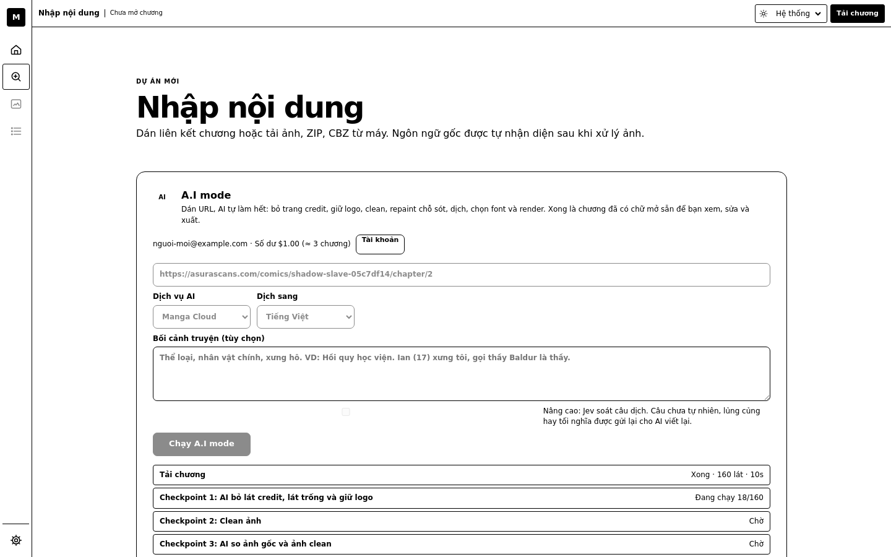
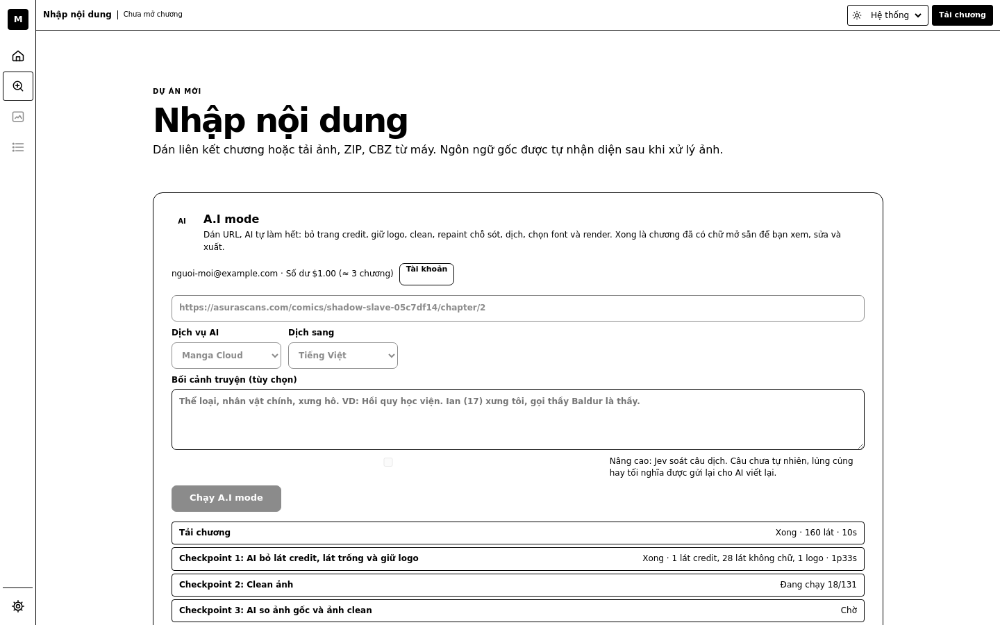
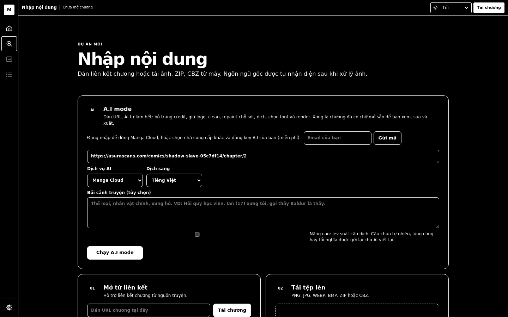

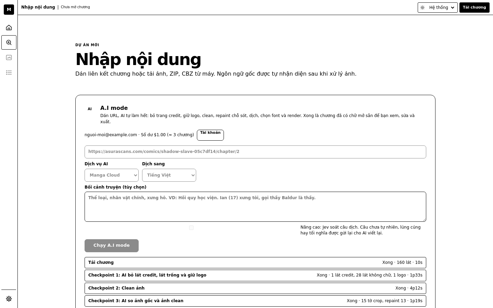

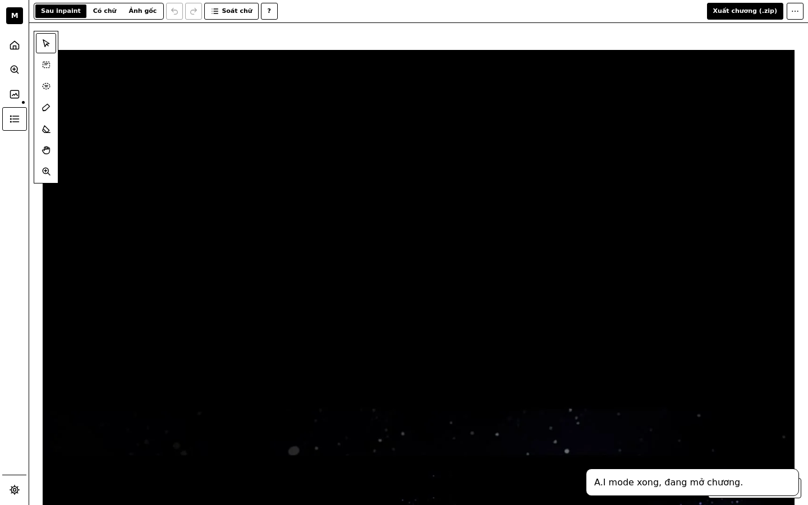

## FAIL · ai-mode-open-result · 30.0s
- FAILED: TimeoutError: Locator.click: Timeout 30000ms exceeded.
Call log:
waiting for locator("#ai-mode-open")
  -   locator resolved to <button type="button" id="ai-mode-open" class="ui-btn ui-btn-primary">Mở chương</button>
  - attempting click action
  -   waiting for element to be visible, enabled and stable
  -   element is not visible
  - retrying click action, attempt #1
  -   waiting for element to be visible, e
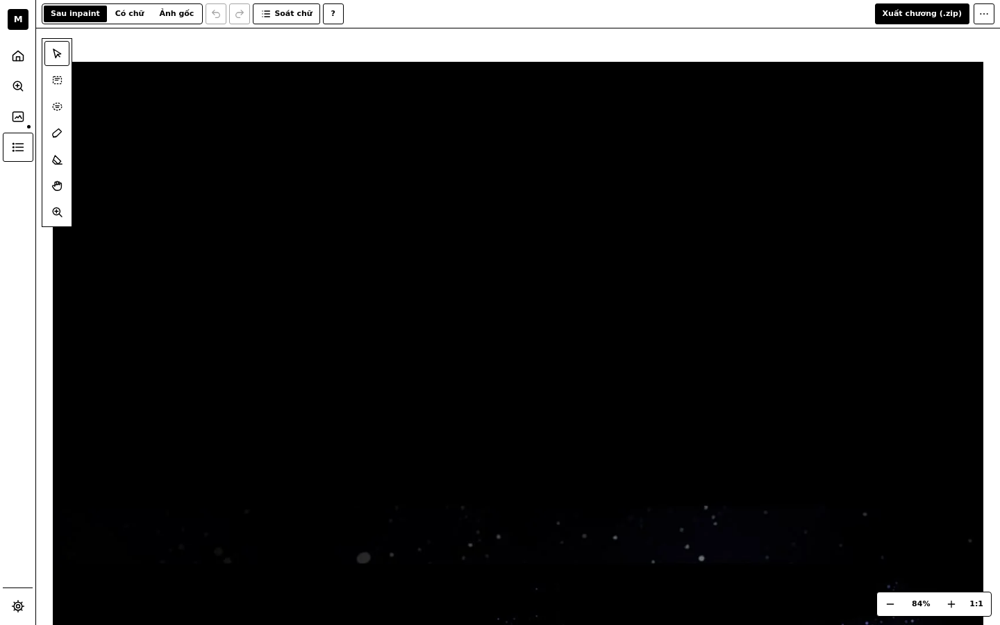
