# Sơ đồ luồng & Kiến trúc — Manga Translator

> Các sơ đồ dùng [Mermaid](https://mermaid.js.org/) — xem trực tiếp trên GitHub hoặc dán vào editor có hỗ trợ Mermaid preview (VS Code + extension "Markdown Preview Mermaid Support", Typora, ...).

## 1. Tổng quan kiến trúc

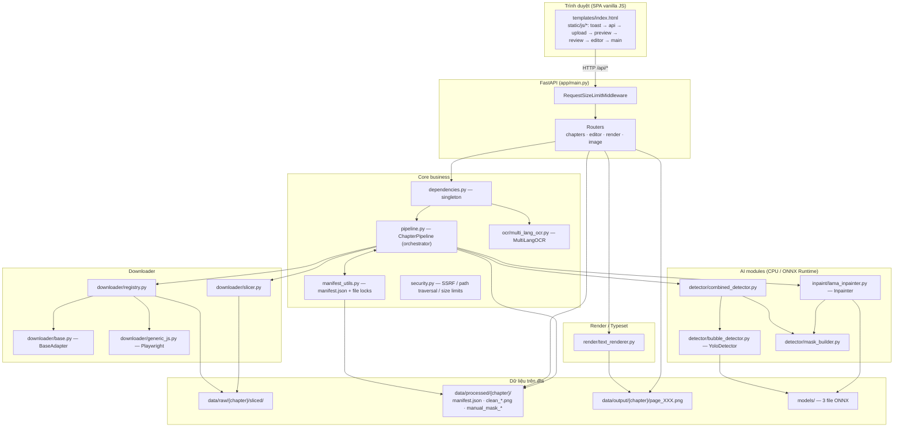

## 2. Khởi động (startup)

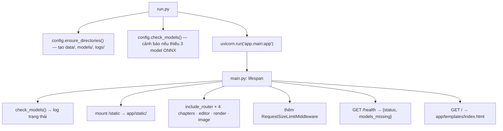

## 3. Tạo chapter từ URL (Import / Crawl)

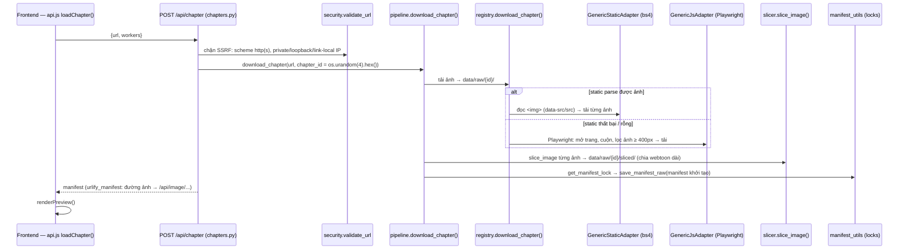

## 4. Tạo chapter từ upload (ảnh / ZIP / CBZ)

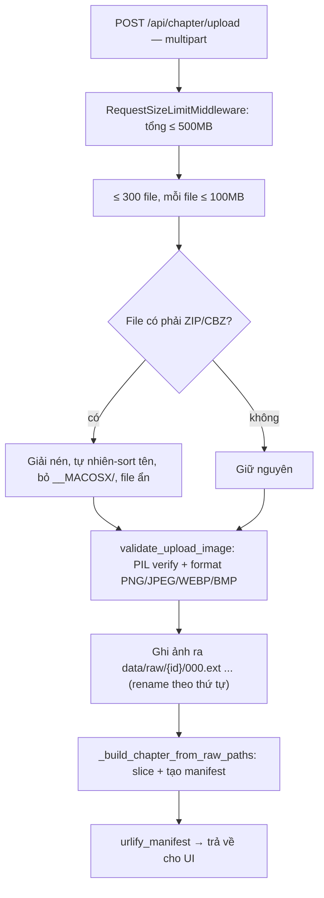

## 5. Xử lý trang — process_pages (luồng chính)

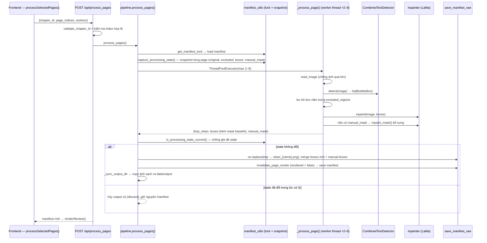

## 6. Detection chi tiết

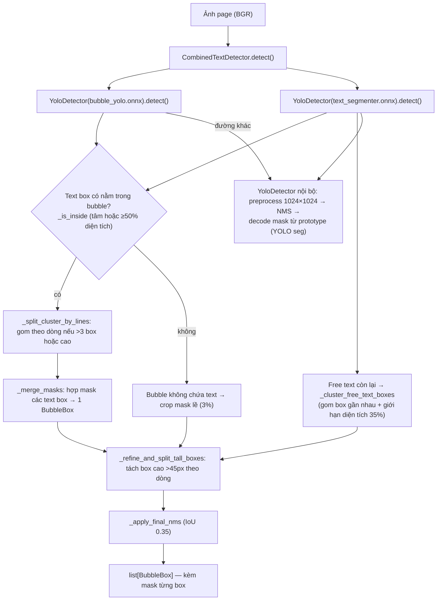

## 7. Inpaint chi tiết

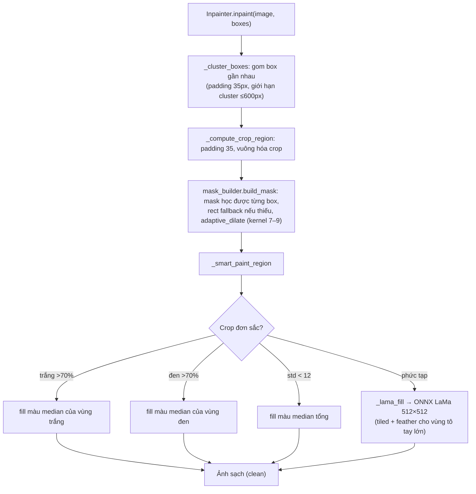

## 8. OCR

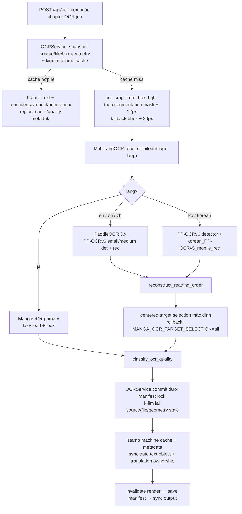

Production routing và knobs:

- Japanese luôn đi MangaOCR primary; không dùng confidence để fallback sang MangaOCR.
- English/Chinese dùng PP-OCRv6; Korean dùng recognizer Korean PP-OCRv5 mobile với detector PP-OCRv6.
- `MANGA_PPOCRV6_TIER=small|medium`, mặc định `small`.
- `MANGA_PPOCRV6_TEXTLINE_ORIENTATION=1` bật model orientation bổ sung; mặc định tắt để giảm cold-start/CPU/memory.
- `MANGA_OCR_TARGET_SELECTION=centered|all`, mặc định `centered`; `all` là rollback nhanh nếu crop đặc biệt cần toàn bộ region.
- OCR `review` vẫn được phép dịch; chỉ kết quả machine OCR `reject` chưa bị người dùng sửa mới bị chặn translation.
- Paddle detector polygon chỉ phục vụ localization/reading order OCR, không trở thành erase/inpaint mask.

## 9. Render / Typeset

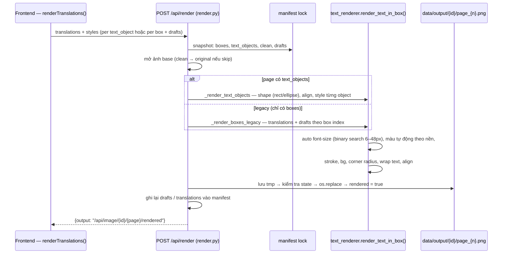

## 10. Sửa tay (Manual repair) — brush / magic wand

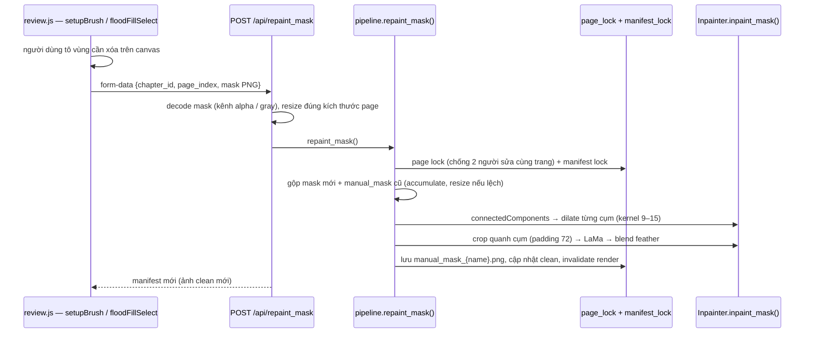

## 11. Frontend — luồng màn hình

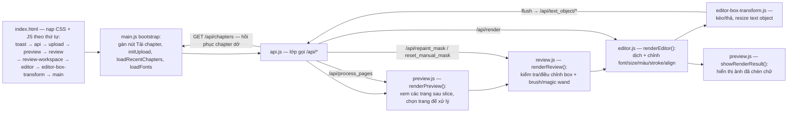

## 12. Concurrency & an toàn dữ liệu

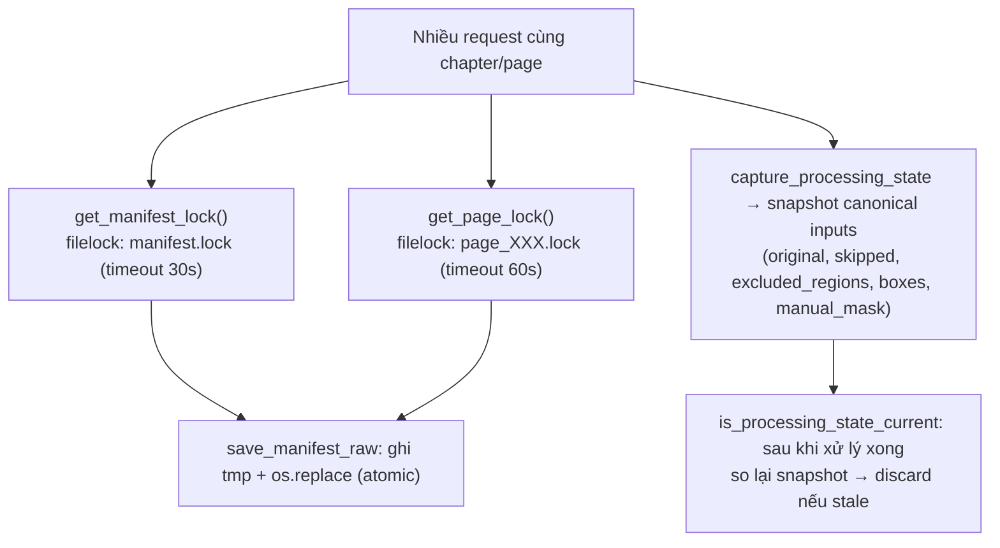

## Ghi chú phát hiện khi rà soát

- `app/static/js/box-item.js`, `editor-properties.js`, `editor-workspace.js` **không được nạp từ `index.html`** — có vẻ là module legacy; hai file sau còn định nghĩa lại `window.renderEditor` (trùng tên với `editor.js` đang dùng).
- `app/downloader/playwright_worker.py` là script subprocess không được `registry.py` gọi — bản dự định thay thế `generic_js.py`.
- Luồng ảnh: `data/raw/{id}` (gốc + sliced) → `data/processed/{id}` (clean, manifest) → `data/output/{id}` (render cuối). Tất cả đều git-ignored.